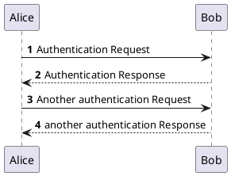

# Headline

> An awesome project.

!> **Time** is money, my friend!




```chart
{
  xAxis : [
    {
      type : 'category',
      data : ['Mon', 'Tue', 'Wed', 'Thu', 'Fri', 'Sat', 'Sun']
    }
  ],
  yAxis : [{ type : 'value' }],
  series : [
    {
      name:'sss',
      type:'bar',
      barWidth: '60%',
      data:[10, 52, 200, 334, 390, 330, 220]
    }
  ]
}
```