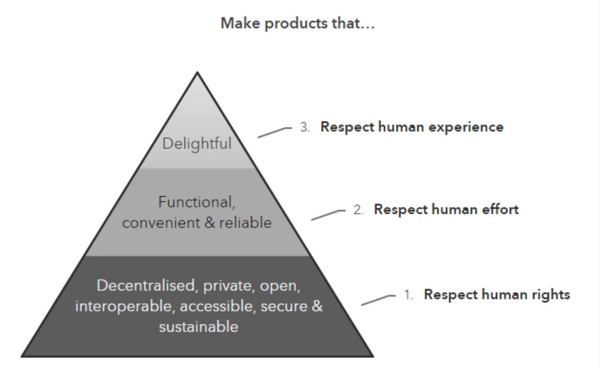

# Ethical Design Manifesto

## How to create products in an ethical, human friendly way.

## Respect Human Rights

- Sustainable = green (our world needs some help)
- Available for all: which also means affordable, not owned by a big company with as purpose greed.
- Decentralised: make sure technology is available everywhere
- Open & interoperable: allow technology to work together in open way
- Accessible: easy to access, fast enough, everywhere in the world
- Secure & private: your privacy is a right

##  Respect Human Effort

- Make sure technology is reliable and lasts longer (no need to replace in 5 years).
- Avoid complexity (KIS): no unnecessary complexity.
- LESS = MORE (do less to achieve more)
- Let people/companies work together in a 100% transparent way.

## Respect Human Experience

- Products should be ergonomic & easy to use
- Design should be global: don’t favour certain user groups!
- Products should look good, but form follow function
- TRANSPARENT: sales, pricing, processes, …

Design your organisations so that your core values are respect for human rights, respect for human effort, and respect for human experience.

credits
original ideas, graphics & text come from https://ind.ie/ethical-design/ (we’ve added our own twist to it)
