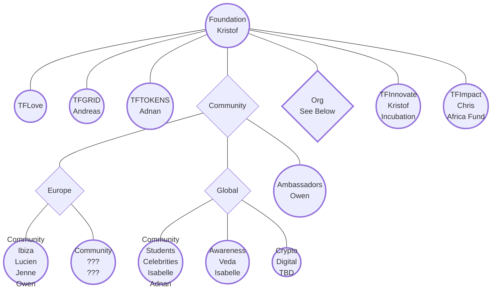
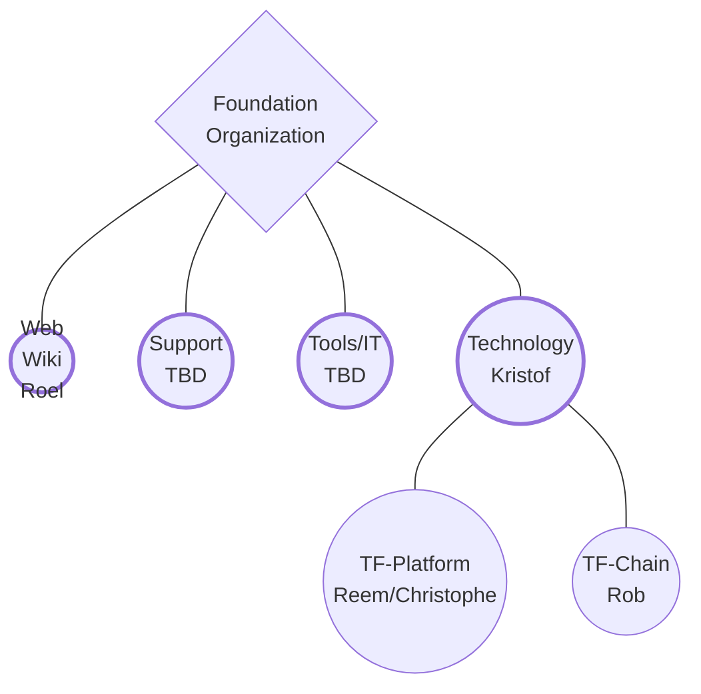

# ThreeFold Circles

## Circles Demystified

Circles are teams of people working on shared tasks, products, services. They are organized around stories, that have the agreement of shareholders. Circles have owners that are not in charge, but support everybody in the circle to reach their goals. The circle owner is also responsible for the set targets, goal or objective. Circles become obsolete when the goals have been reached. Objective is to create small circles with clear stories, responsible capable owners and motivated circle members.

Below picture visualizes the [ThreeFold Foundation Circle](/circles/foundation/foundation.md) and its subcircles, with in each circle the name of the owner:

And this picture visualizes the [ThreeFold Organization Circle](/circles/tf_organization/tf_organization.md) and its subcircles, again with in each circle the name of the owner:

## ThreeFold Circles

Each of the following ThreeFold circles have subcircles:

- [**ThreeFold Foundation Circle**](/circles/foundation/foundation.md)  
- [**Community App Circle**](/circles/community_app/community_app.md)
  
## Circles of ThreeFold Cooperatives
  
  - [**BetterToken Circle**](/circles/bettertoken/bettertoken.md)
  - [**Mazraa Circle **](/circles/mazraa/mazraa.md)

## How to work together

- [Collaboration at ThreeFold](/collaboration/README.md)