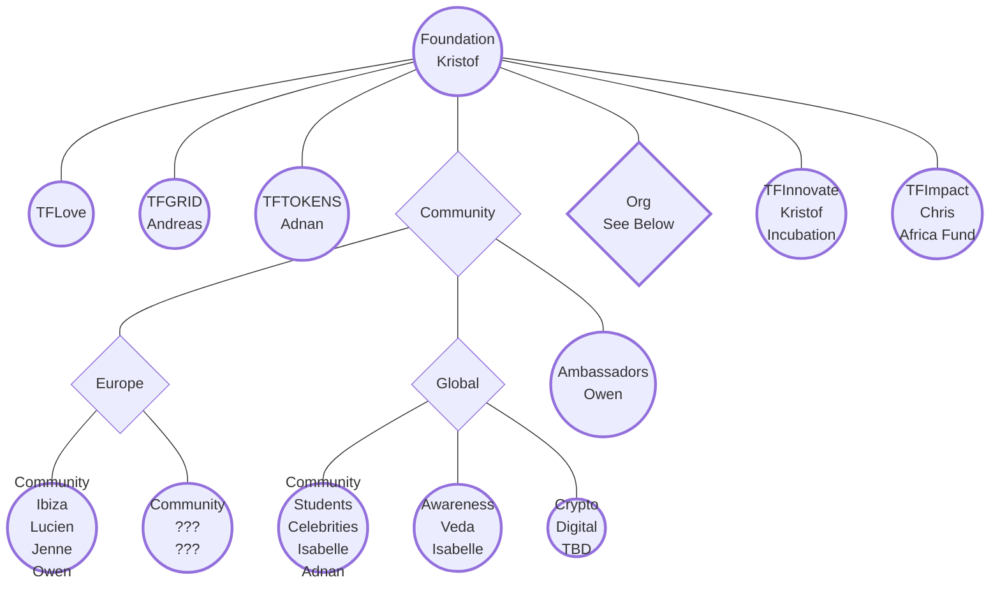
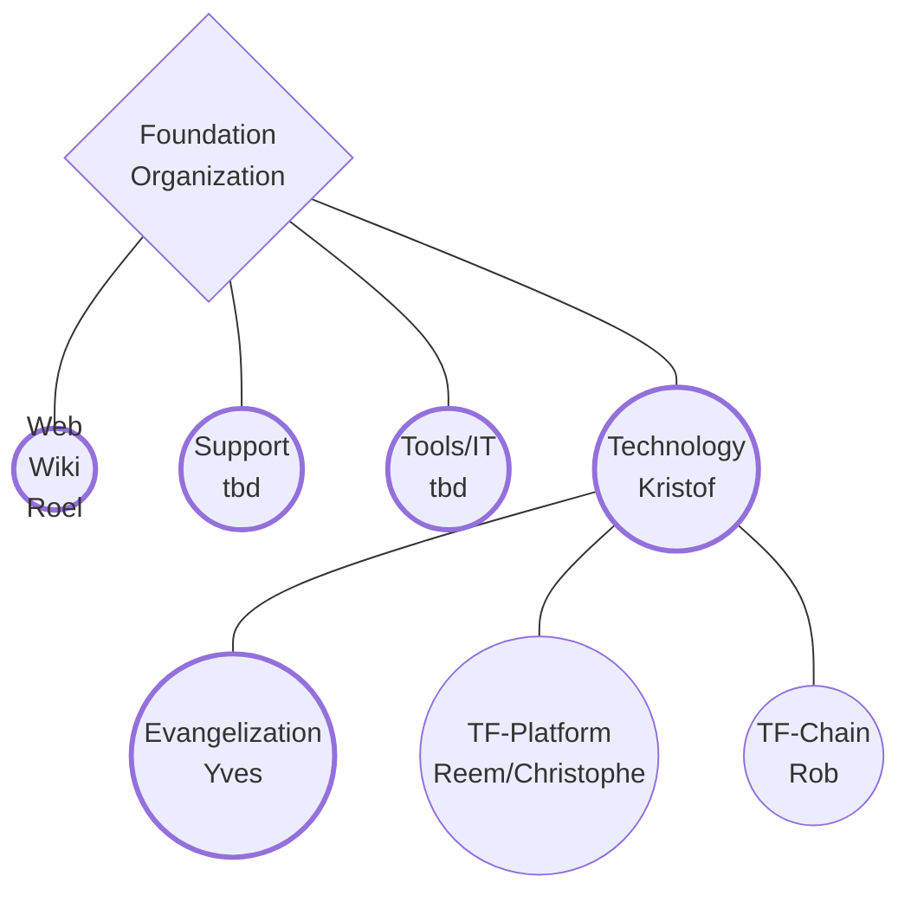

# ThreeFold Circles

## Circles?

Circles are teams of people working on shared tasks, products, services. They are organized around stories, that have the agreement of shareholders. Circles have owners that are not in charge, but support everybody in the circle to reach their goals. The circle owner is also responsable for the set targets, goal or objective. Circles become obselete when the goals have been reached. Objective is to create small circles with clear stories, responable capable owners and motivated circle members.

- [**ThreeFold Foundation**](/circles/foundation/foundation.md)  
  - Help other circles to be effective, and coordinate work between the circles.
- [**ThreeFold Grid**](/circles/foundation/grid/grid.md)
  - Promotes the ThreeFold Grid as a new, global, neutral and sustainable network of IT infrastructure.  
- [**ThreeFold Tokens**](/circles/foundation/tokens/tokens.md)
  - Promotes the ThreeFold Token to gain global adoption.
  
## Circles of ThreeFold Cooperatives
  
  - [**BetterToken**](/circles/BetterToken.md)
  - [**Mazraa**](/circles/Mazraa.md)

## How to work together

- [Collaboration at ThreeFold](/collaboration/readme.md)
