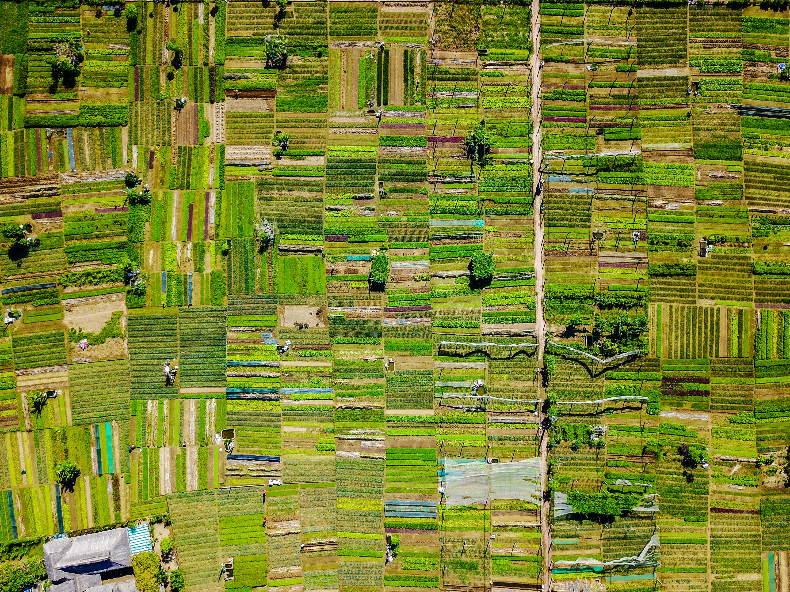

# ThreeFold Grid Circle

## Purpose/Mission
- To promote the ThreeFold Grid as a new, global, neutral and sustainable network of IT infrastructure created by ThreeFold Farmers.  
- To support farmers with tools and information (technical and non technical) in decision making and joining the grid.

### Communication Channels

- [FreeFlowPages Space for Farming](https://freeflowpages.com/s/tf-grid-farming/)
- [FreeFlowPages Space for Users](https://freeflowpages.com/s/tf-grid-users/)
- [Telegram Chat for Farmers](https://t.me/joinchat/BwOvO0NpZjNMHFx8wD_5nw)
   

### Websites/Wiki

- [Wiki](https://threefoldfoundation.github.io/info_grid/#/)
- [Grid directory](https://capacity.threefoldtoken.com/)

## Coordinators

- Andreas: coordinator of TFGrid BizDev & Overview Grid Team Scrum Coordinator
- Weynand coordinator of Grid related Farmer and Technical Content (TF Grid WIKI)
- Jan coordinator of Mattermost ThreeFold technical Community (Hardware Compatibility)
- Georges coordinator of Legal Affairs (T&Cs, Contracts)
- Stela coordinator of Events (Local Community Events)
- Sabrina coordinator of Community Communication & Support

## Goals

Until end of the year 2018 the focus is 100% around coverage - creating a global grid in as many locations as possible in as many as possible countries.
Specific goals:
- Bettertoken: 1000 small boxes until end of 2018
- Mazraa: 300 small boxes until the end of 2018
- Hujambo: Goal is investment volume of TF Fund 1
- TFF: find cooperatives in North & South America, Russia/CIS and Japan

## Strategy

- Support cooperatives and individual farmers by providing information and support through web, wiki and chat/forum.
- Create scalabilty through cooperatives
- Establish new cooperatives in North & South America, Russia/CIS and Japan (as a first Asian hub)
- Colaborate with ambassadors to establish farmer beach-heads in new territories
- Grow farmer community through local community events (Tech?non Tech)

## Timing

- June
   - have all the basics implemented of circles and contributors
   - link all contributors to right circles
   - make sure contributors understand what their role is
- Week of June 4th
   - WIKI version 1.0 live
- Week of June 10th
   - TFGrid webiste 1.1 live
- September to November 2018
   - Community roadshow in 10 European cities

## Contributors

- Andreas coordinator of TFGrid BizDev & Overview Grid Team Scrum Coordinator
- Weynand coordinator of Grid related Farmer and Technical Content (TF Grid WIKI)
- Elena coordinator of Token Road Map Web (TF Grid Website)
- Jan coordinator of Mattermost ThreeFold technical Community (Hardware Compatibility)
- Georges coordinator of Legal Affairs (T&Cs, Contracts)
- Stela coordinator of Events (Local Community Events)
- Sabrina coordinator of Mattermost ThreeFold Grid News (Chat & News)
- Full Team Detail @ [contributors](https://github.com/threefoldfoundation/info_foundation/tree/master/docs/contributors)

