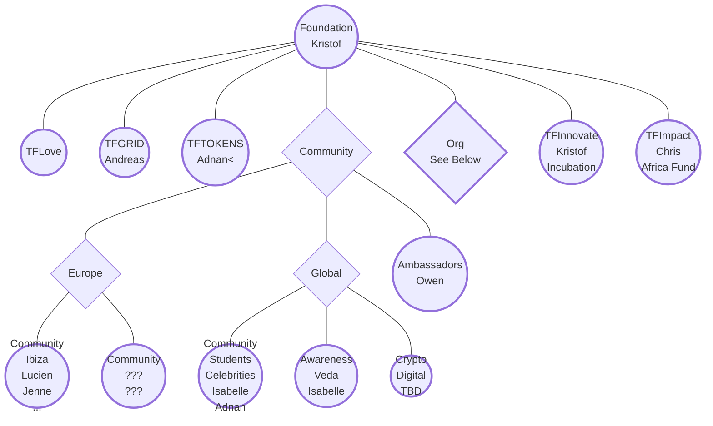
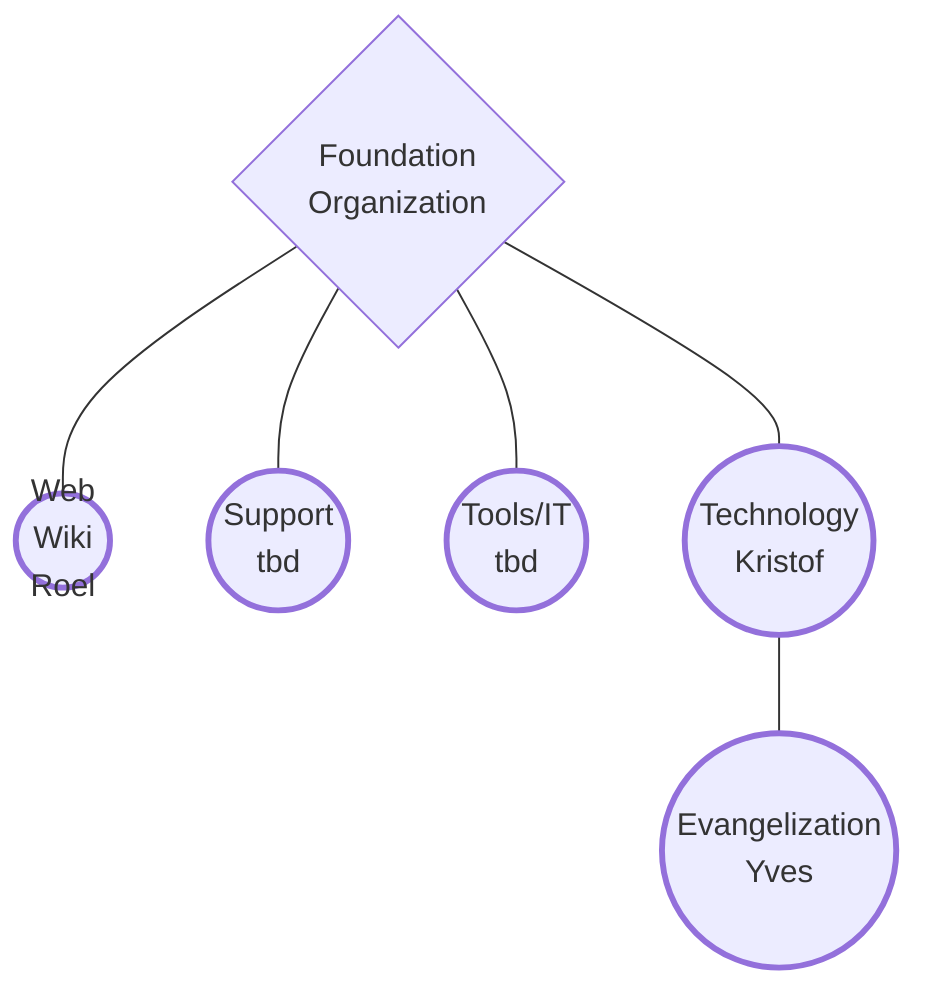

# ThreeFold's Main Circles

- [**ThreeFold Foundation**](/circles/foundation/foundation.md)  
  - Help other circles to be effective, and coordinate work between the circles.
- [**ThreeFold Grid**](/circles/foundation/grid/grid.md)
  - Promotes the ThreeFold Grid as a new, global, neutral and sustainable network of IT infrastructure.  
- [**ThreeFold Tokens**](/circles/foundation/tokens/tokens.md)
  - Promotes the ThreeFold Token to gain global adoption.
  
## Circles of ThreeFold Cooperatives
  
  - [**BetterToken**](/circles/BetterToken.md)
  - [**Mazraa**](/circles/Mazraa.md)

## How to work together

- [Collaboration at ThreeFold](/collaboration/readme.md)
