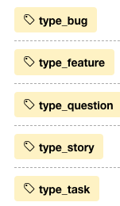
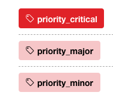
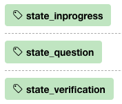
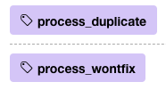
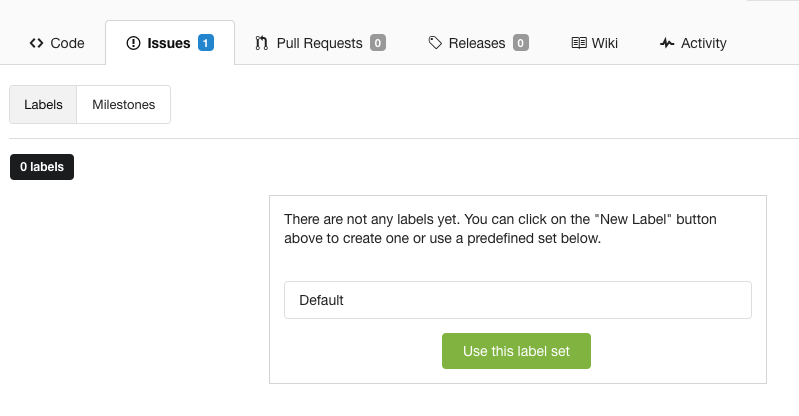
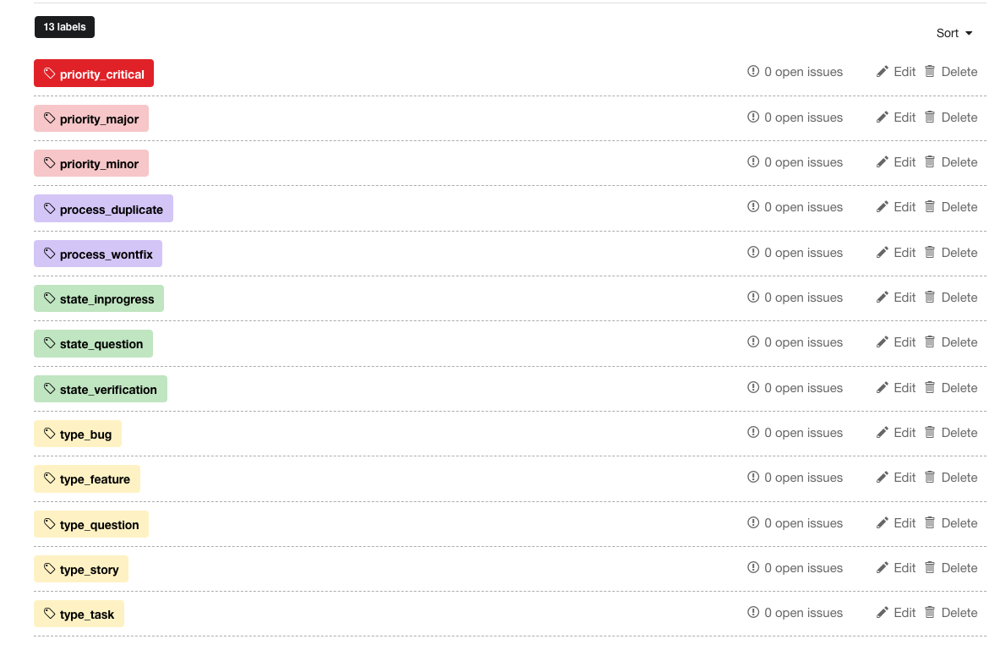

## Labels 

 labels play an important rol to run the EP (Efika Process)

### Type

- To define type of issue
- 1 needs to be used (and only 1)!

| Name | Description | Used in |
| ---- | ---- | ---- |
| story | ... | home, org, project |
| task | ... |  home, org, project |
| ticket | issue as reported by customer using e.g. a service | org, project |
| bug | issue reported by anyone to with a product | code, itenv, doc, www |
| feature | improvement asked for by anyone | code, project, itenv, doc, www, org |
| question | anyone wants to ask something | home, code, project, itenv, doc, www |
| monitor | monitoring system found an issue | project, itenv, www |
| lead | lead for sales, can convert in business | project, org |

### Priority

- Define priority in which issue needs to resolved
- 0 or 1 can be used, the default is normal and has no label, no need to mark.

| Name | Description | Used in |
| --- | --- | --- |
| critical | act on it as soon as possible | all |
| major | finish for sure this week, but earlier better | all |
| minor | can be this sprint or next sprint if needed (if short of time) | all |

### State

- Define state of issue in the Kanban flow
- 1 needs to be used, and only 1!
- Remark
  - These states need to be useful over all projects, e.g. over customer projects, code projects, stories, ...
  - Good filters should be used in Kanban to represent a Kanban well

| Name | Description | Used in |
| --- | --- | --- |
| new | new or issue in backlog (is no label, is the default)| all |
| inprogress | people are working on it | all |
| question | needs input | all |
| verification | testing, verification with customer | all |
| closed | means issue closed, no longer relevant, there is no label on it | all |

### Process

- Define 2 optional process related labels, not often used

| Name | Description | Used in |
| --- | --- | --- |
| duplicate | there is a duplicate for this issue | all |
| wontfix | suggest not to fix | all |

# Howto for labels

## how to set default labels on EE

go to issues -> labels.

Click on use this label set.
This will create the default labels in the E-Repo

result is following labels:

