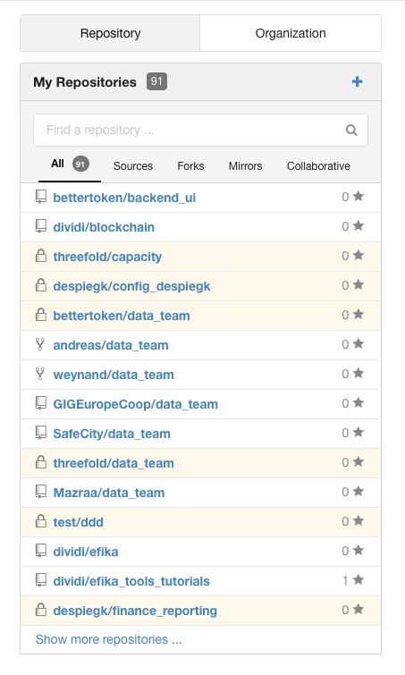
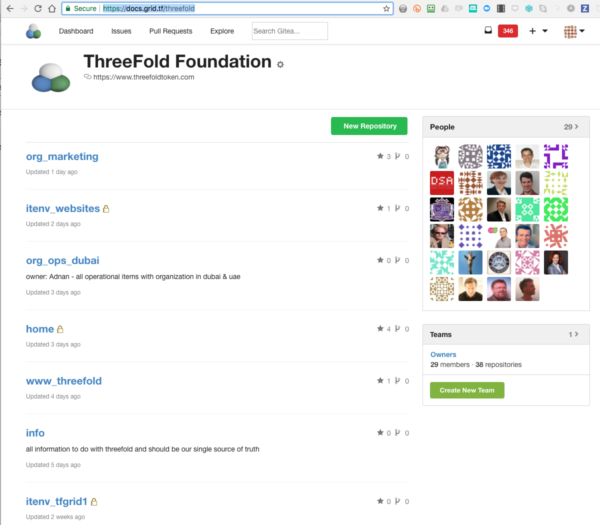
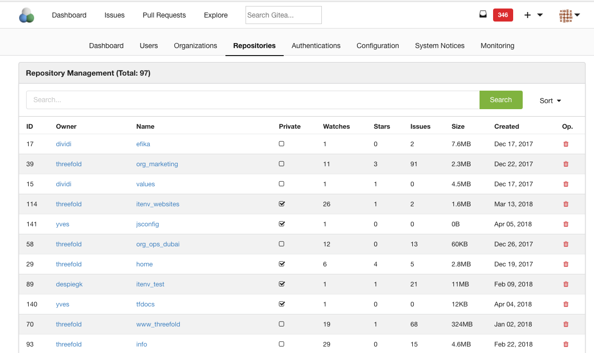

## Repositories

Are the repositories as used in 1 organization.
They are the main form of organizing the work in an organization per e.g. project or per suborg

for more info about how to use the repos see [repositories](../EfikaProcess/repositories.md)

to see which repo's you have access to go to dashboard and click on 'my repositories'

you can search in the search box its super easy.

overview of repo's in threefold (as example): [https://docs.grid.tf/threefold](https://docs.grid.tf/threefold)

or at admin level:

