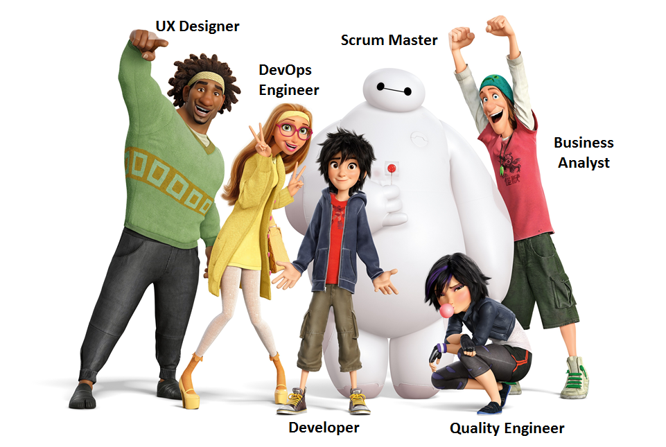

# Scrum Team

Above more done for a development organization but can be done for any purpose e.g. project.

The scrum team in scrum process is a collection of individuals with cross-functional capabilities (Sales, Business Development, Developers, Designers Etc.) working as a single unit to deliver the work they collectively committed to accomplishing within an iteration.

The effectiveness of a scrum team is determined by their capability to work together as a special unit (Think about an elite army unit) that follows a common goal and vision determined by the stakeholders (for product or project or other goal), this factors are critical for any methodology but particularly in scrum process that embraces collaboration and respect among the team individuals.
  
In addition, we need to keep in mind that it will take some time until the team will deliver with the highest possible standards right from the beginning (Based on my experience it normally takes about 4-6 months for a team to work at the highest performance), the improvement of the team depends mostly on the team itself, but also on the external stakeholders such as the scrum master and stakeholders.  

## What should be the size of the scrum team?

Scrum teams are self-organized teams with an ideal size of 7+/- 2 members. If the team size will be larger than the Max suggested size (Nine team members), the team communication will become less efficient from what we expect. 

Now, if we need to add more resources to the team to handle the work effort, we will split the team into multiple independent scrum teams that will collaborate and synchronize with each other to achieve the project goal.

## Characteristics of great scrum teams

For a scrum team to perform at the highest level, there are some basic guidelines and rules that each member of the team should follow:

- The knowledge and technical skills within the scrum team are balanced.
- Team members are dedicated to the team
    - if full time: they do not work for other teams
    - if parttime e.g. a contributor: see below
- Team members should follow the same rules, norms, and guidelines.
- Each team member share is knowledge with another team member.
- Motivated people that embrace the upcoming challenges. 
- The team is empowered and Self-Organized
- Should respect the other team members.
- Should follow a common goal.
- Should believe in the process.
- Should work together.

## The responsibilities of the scrum team 

The scrum team and each of the team members have a set of responsibilities which have to be fulfilled in order to achieve a common goal:   

- They must report for any impediments that affecting their progress.
- They should update their daily progress in the scrum meeting.
- They have to work together to achieve each iteration goal.
- They should add real action items in the retrospective meeting that will enforce the most important rule in Scrum of continues improvement. 
- They should break-down the user stories into smaller tasks, estimate them and make sure they are delivered.
- They have a responsibility to attend in different scrum ceremonies (e.g. daily scrum meeting)
- They have the critical responsibility to deliver potentially shippable product or milestone in a project at the end of each iteration.
- They should make a real-time estimation regarding the work effort they should perform in a sprint = milestone.

## what about individual contributors?

By definition a scrum team is about focussed people putting all their effort in the sprint & goals of the team. Ofcourse such teams welcome the input from individual contributors.

To be able to work with people who don't have a fulltime available to work in the team requires good communication from the team and the contributor e.g. through comments on the story cards or on tasks.

TODO: *2 write more about how this can work.

[orginal text](http://www.machtested.com/2017/05/scrum-team-roles-responsibilities.html)