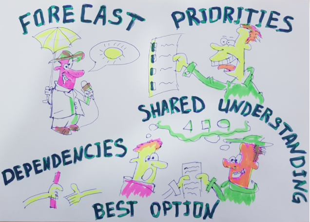

# Stakeholder meeting

## Goals

- review the stories for the current and/or next sprint (milestone)
- decide on priorities 
- move stories if required
- if stories not good enough defined, push them back to backlog and ask for better preparation
- make sure everyone understands what will be delivered in next spring and get agreement about prios.

## Preparation

Do not start a stakeholders meeting before the stories in the sprint to be discussed are properly prepared !!!

- Info in stories to be discussed is complete:
    - Requirements, Acceptance Criteria, ... (see [stories](stories.md))
- User stories are prioritized with the most important items are listed at the top.
- It's clear so every relevant stakeholder can understand it.
- Large user stories are broken down into smaller stories so they can be completed in a single iteration.

## Who should participate? 

The meeting stakeholders are the product owner(s), the Scrum Master(s) and the Scrum Team. 
Anyone else who has something to win or loose with the stories selected.

## Time-boxing

Same as any other meeting in the scrum, this meeting is also timeboxed for a specific amount of time. This meeting should be restricted to 60 minutes to really allow the team to become familiar with the stories and for the product owner to make the adjustment in the product backlog

## The Frequency

+- once every week, max every 2 weeks.

## Procedure

- The scrum master will schedule the meeting and invite the relevant participants, the invitation will include link to all relevant info (kanban, ...)
- In meeting, the product or project owner(s) will review the stories relevant for this and optionally next sprint (milestone).
- Once everyone understands the stories, everyone can comment and give advice.
- As a team the stories which need to be prioritized or moved get accepted.

## ENSURING CLARITY, TESTABILITY, AND SIZE

Once the user stories are chosen to the upcoming iteration, we must ensure that they are Clear and testable so the team can take real commitments during the planning meeting.

### Clarity

We can say that a user story is clear only in the case that the entire scrum team members have a common understanding of its areas including the requirements, Acceptance, and Definition of done criteria.

### Testability (for product related stories mainly)

And what about the user story "Testability"? A user story is testable only if there is a real and effective way to determine whether the requested requirement is fulfilled within the iteration in which it is supposed to be implemented.  

### Size

The size of a user story should be small enough so the team can complete it in a single iteration, the team can determine if a user story can be delivered in a single iteration based on the Definition of Done determined for the story and its dependents in other stories.

*original info: [1](http://www.machtested.com/search/label/Scrum%20-%20Scrum%20Meetings) & [2](http://www.machtested.com/search/label/Scrum%20-%20Iteration%20Planning)*