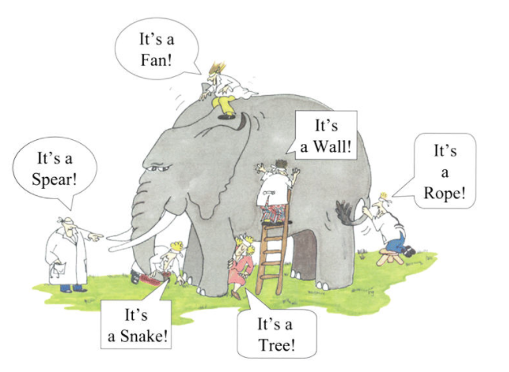

# Story Pitfalls

## Too Large stories

Although the agile methodology provides some great process and tools to handle delays and bottlenecks that may arise during the iteration (Move it to the next iteration, rework and modify the story Etc.), we want avoid this scenarios by creating stories that will allow the team to take commitments that based on short units of work. Stories that created with the original scope that determined by the team during the planning meeting and modified during the iteration may increase the scope of the story in a way that will reduce the percentage of the team to meet their original commitments.

Stories that are changed throughout the iteration are more than welcome, this is agile all about (We embrace changes in requirements to satisfy the exact needs of the customer). However, there is a way to handle these requirements by splitting the original story into two (or more) stories that will allow the team to focus on their original commitments and then handling the new stories. 

## Lack of Visibility

Stories that are not visible to the relevant stakeholders can lead to many problems such a lack of communication, failure to understand the “Big” picture and most importantly the ability to make an efficient prioritization.

## Technical tasks that were written as user stories
There is a reason that user stories containing tasks and no the opposites, tasks should not be added to the product backlog in a makeup of user stories; this pitfall is mainly relevant to new teams that are not familiar with the different artifacts of Scrum.

    As a result, the team members add technical tasks as user stories, which may lead to confusion among the stakeholders once they need to prioritize the product backlog or determine which stories will be added to the next iteration.

## The business value is not taking into consideration

We should always remember that the importance of the user story is mainly based on the value that it adds to the customer/community if the user story is written without the product owner really understand the business value that this story will add to the client, how can he make a real and effective prioritization process? To be able to make an effective prioritization process, the product/project owner must understand the business value of each user story and why it was originally requested by the customer/community. 

## Stories that were written without collaboration

Collaboration among the relevant stakeholders is the main key to succeeding at writing great stories. Both the product owner and the team (Developers, Testers Etc.) should all collaborate prior to wring a user story. But making this collaboration, each role can contribute his own knowledge and experience that will most likely help to create improved and efficient stories.

## Stories that do not provide answers

To write a great user story, the creator should provide answers to some basic questions:

- What should the team develop to meet the customer request?
- What is the business value of this story?
- What is the acceptance criteria that the team members should follow prior to starting the story?
- What is the Definition of Done that the team should accomplish prior to them to mark the story as “Done”?

Failure to provide answers to those basic questions will lead to confusions that will affect both the quality of the team deliverables and commitments.

[original info](http://www.machtested.com/search/label/Scrum%20-%20User%20Stories)
