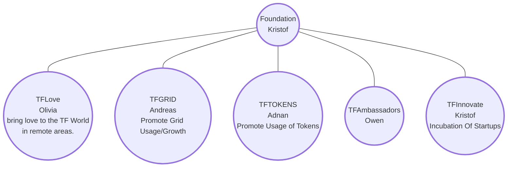

# Circles

Circles are defined in https://github.com/threefoldfoundation/info_foundation/blob/master/docs/circles/

```mermaid

graph TD; 
    Foundation((Foundation<BR>Kristof)) --- TFLove((TFLove<br>Olivia<br>bring love to the TF World<br>in remote areas.))
    Foundation --- TFGRID((TFGRID<br>Andreas<br>Promote Grid Usage/Growth))
    Foundation --- TFTOKENS((TFTOKENS<br>Adnan<br>Promote Usage of Tokens))
    Foundation --- TFAmbassadors((TFAmbassadors<br>Owen))
    Foundation --- TFInnovate((TFInnovate<br>Kristof<br>Incubation Of Startups))


    classDef circle text-align:center,stroke:#33,stroke-width:3px;  

    class Foundation,TFLove,TFGRID,TFTOKENS,TFAmbassadors,TFInnovate circle;

```