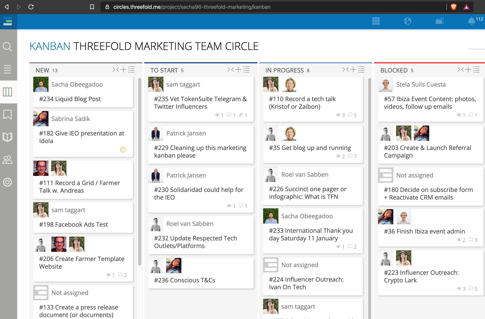
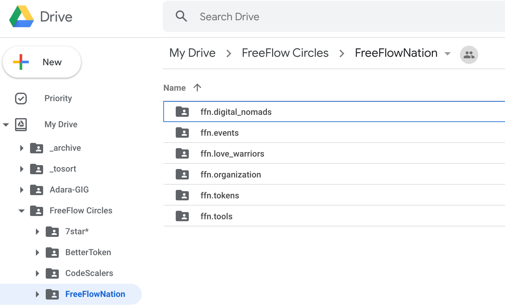
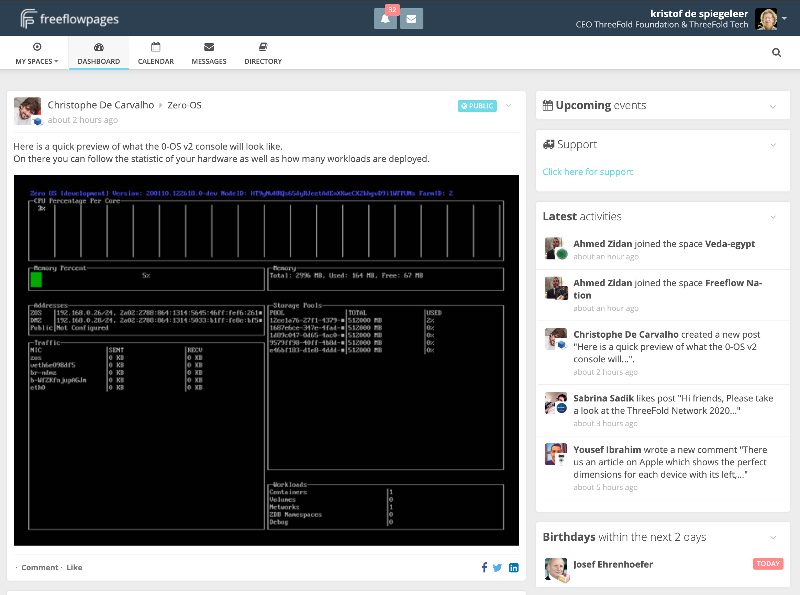
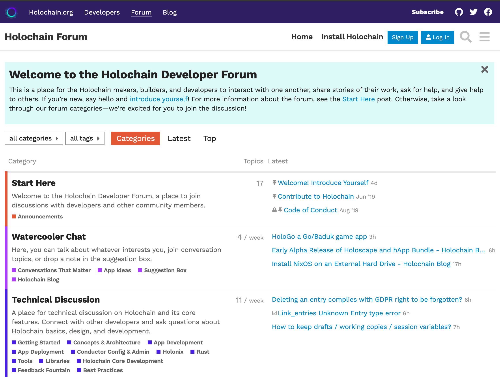

# Circle Tools

## Aims of our tools

- Clarity, Traceability, Transparency and Active Teamwork.
  - Clarity: try to ensure that your communications are clear, understandable, well written and purposeful.
  - Traceability: we are a complex organisation attempting something amazing, it is important we can work out who contributed what and when so we can come back to them for clarification if needed!
  - Transparency: we are open communicators, we want to be brave enough to share the good, the bad and the ugly. To be honest with each other, without being unkind. To celebrate with each other whole-heartedly when we succeed.
  - Active Teamwork: every tool is there for us to take focused action towards our common goals. Use them to help the team move forward towards completed work as efficiently and effectively as you can.

## Tools

### Circles Tool

see [https://circles.threefold.me/](https://circles.threefold.me/)



### Google Docs

each circle corresponds to a folder on gdrive




- All non-wiki docs need to go to the correct shared folder on Google Drive.
- Do not keep docs which will be shared with other people in your own drive.
   - Create the doc directly in the correct folder on the shared drive, this ensures that everyone who has access to that folder can follow the progress of all files in that folder.
- Edit directly in Google Docs. Do not import from other formats, or export and import. It is really hard to stop this introducing all kinds of awful formatting which can cause pain and wasted time later on.
- When creating presentations: use master slides & link them to the presentations used within the community.
- Use the comment feature (ctrl/cmd+alt+m) to collaborate with each other. If you use +username, it will automatically assign the comment to the person and email them.
- Everyone contributing more than a couple of hours per month should have a gmail account in our organization within our incubaid.com Gsuite domain.
   - Ask for an account on an appropriate domain name.
- Practice good file hygiene. Use ```_archive/_beta``` folders in each drive to organise docs, only ACTIVE content should be in the standard folders. 
   
## Google Mail

- Everyone contributing more than couple of hours per month should have a gmail account in our organisatio on Google within our incubaid.com Gsuite domain.
   - Ask Roel for an account on an appropriate domain name.
   - Any cooperative or other organisation that wants to be part of our domain, please contact us. It will help to organise our community.
- You can get email aliases on any of the organizations e.g. threefoldtoken, etc. Learn more about how to add and use aliases [here](https://support.google.com/mail/answer/22370?hl=en)
- Ensure you use the right alias and signature when sending an email.

### Telegram: chat

- Try to organise your conversations into well-ordered and understandable topics.
- ThreeFold Foundation has a public discussion group here [ThreeFold Token English](https://t.me/threefoldtoken_chat)
- Telegram is available for Phones, Tablets and PC/Laptops making it easy to keep track.
- Most circles will have a chat group as well, this chat group needs to be linked to the wiki part of the circles tool

### 3bot connect

- mobile tool for following functions
  - wallet TFT
  - authentication for all our tools
  - link to FFP on phone
  - link to forum on phone
  - link to chat on phone


### FreeFlow Pages (specific to ThreeFold/FreeFlow)

- our social media tool
- Any circle can create its own page on [freeflowpages.com](https://www.freeflowpages.com) to communicate with the TF community, TF enthusiasts, etc..




## Technical & Product Oriented

### FreeFlow Forum

- forum to let people ask questions and look gor answers



nicely orgnized example of what a forum can do


### Github

- each company/organization has one or more accounts on github
- e.g. https://github.com/threefoldtech
- e.g. https://github.com/threefoldfoundation
- in each account there is the home repo which has the relevant info about what is available in the account
- projects are used to organize our planning e.g. https://github.com/orgs/threefoldtech/projects

### Gitea

- The Threefold movement has its own GIT platform, this can be used for more internal documents and repos.
- e.g. https://docs.grid.tf/

