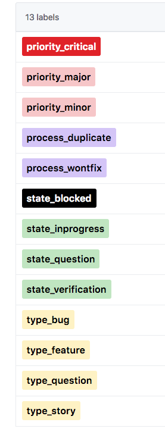
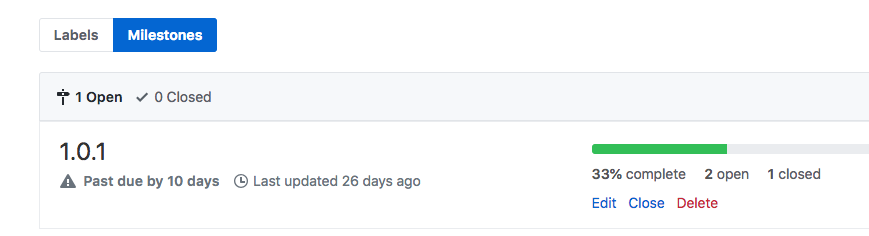

# Content Rules - Github

__Github__ has proven to work to let millions of people collaborate.

## Single source of truth

We do whatever we can to store everything in Github. This gives us following advantages:

- version control
- merging capabilities
- issues can be created where content is
- milestones can be used to organize work (is like roadmap)
- [Github Project Boards](https://help.github.com/en/articles/about-project-boards#templates-for-project-boards) gives a nice overview of work which needs to be done

### Some repo types

- info_... all content in markdown documents, to be re-used in website's
- www_... website(s) content
- data_... for data (if not part of info_ ... or not hosted somewhere as webservice)

## Github first

- All issues/feature requests/stories/questions to do with __content__ (product, info, website, ...) goes onto a github repo.

## The (only) labels we use

__Labels__ are used for 

- type
- priority
- state 

__Milestones__ are used to put issues into certain milestone.
The Milestones are the same over all repo's.

__Projects__ since waffle is closing doors, Github projects are a good way to have a [kanban view](https://help.github.com/en/articles/about-project-boards#templates-for-project-boards)

## DO NOT

Use trello to organize work around content, should only be in github.
In Trello can create a card which links to kanban for e.g certain milestone.

