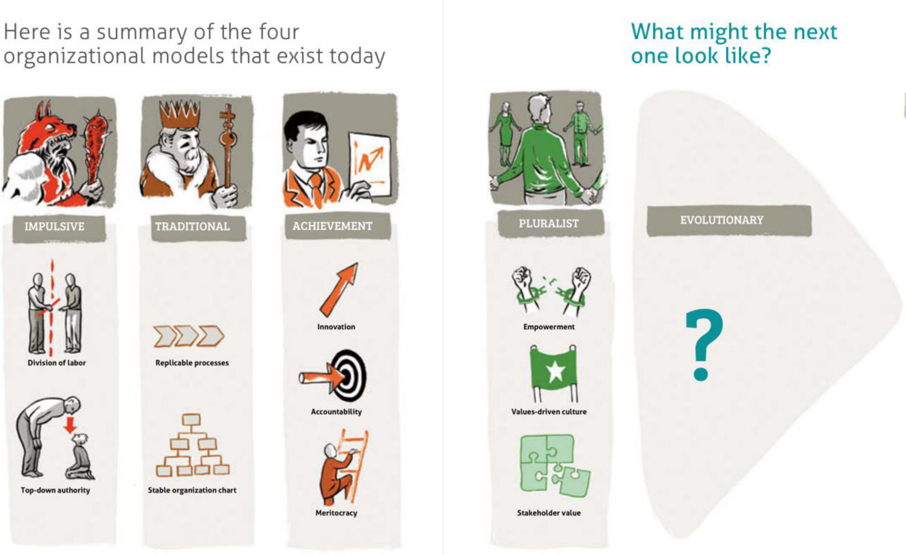
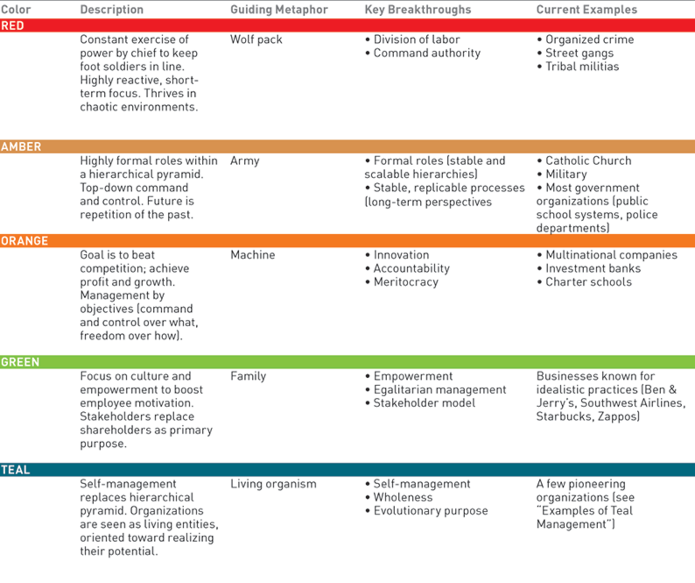

## Teal

We believe Teal organizations are the future form of organizations.
The embrace values and let people work together in much more efficient ways.

- [intro for teal](teal_organization_intro.md)
- [difference between current company structures & teal](teal_differences_with_companies.md)

### not teal but linked to it

- [example organization culture manifest](teal_org_culture_manifest.md)
 

## teal organization

Teal organizations are decentralized into autonomous teams or groups. Power is shared and people are self-managing. Decisions are made independently – there is no centralized group telling people what to do. Decision-making independence is enhanced with visibility and advice. Trust replaces process. People’s whole selves (mind, body, heart, spirit) are welcomed. The organization evolves through an emergent process since everyone can make decisions. The metaphor for Teal is that of a living system. 

- [what is](http://www.reinventingorganizationswiki.com/Teal_Organizations)
- book about teal, fantastic read
    - see http://www.reinventingorganizations.com
- [some principles](http://agilitrix.com/2016/04/teal-organization-illustration/)

## Some other remarks

- [do we need a old school company board?](http://www.reinventingorganizationswiki.com/Board)

