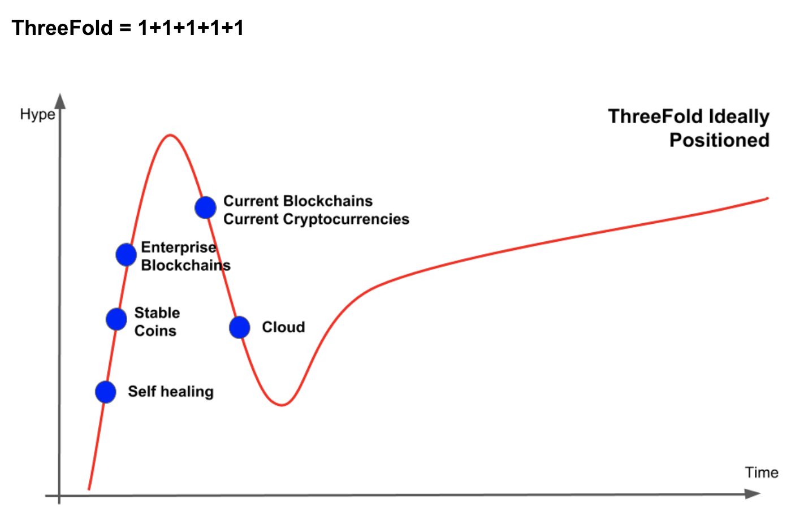
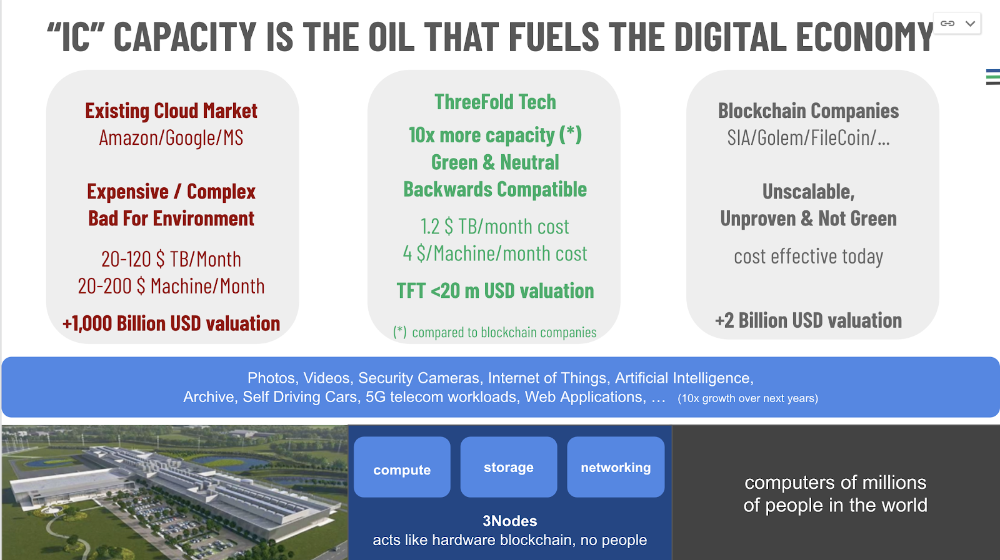
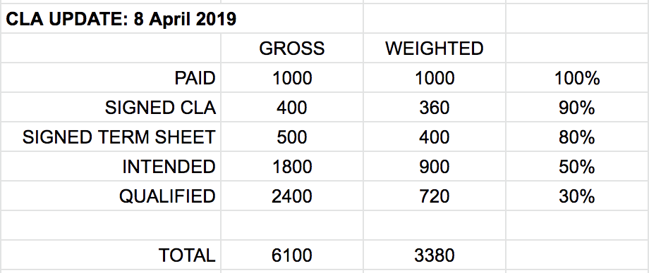

## ThreeFold Update April 2019

Dear ThreeFold Friends,

The last months have been very busy for the ThreeFold team, but we’re having a lot of fun and we are enjoying the journey.

We have been lucky to meet lots of members of our community. It was great and we cannot thank you all enough, It's heartwarming and makes us sometimes feel very small to see how so many of you go out of your way and want to make this happen.

Thank you SOOO much from all of us.

We are not like the average project, we did not choose to give in to the hype, we constantly choose to act first then talk. On certain topics, we have a delay but, on many more, we are making amazing progress.

Our TFT launched only about 1 year ago. We are mainly happy with the progress made on our community and partner level. So many partners are now going their own way. See our ecosystem overview document.

I hope you enjoy reading this update

Regards and thank you all

Kristof

ThreeFold Founder

A lot of content has been created but I believe especially the following documents are worth reading: \

*   [ThreeFold Movement 3 pager](https://docs.google.com/document/d/19tKYDz8J8TehmKS5m4Gm5Y5Atzm5_Ufc31w4vPIFjPY/edit?ts=5c8fbb8d#heading=h.nebll7bcgh6o)
*   [Blog: a decentralized IT system does not exist yet.](https://docs.google.com/document/d/1uZT03h4QLBh2RYEnUjZQvi2Xoy8fjbUn1eZN_PM8g6g/edit#) (DRAFT, still in writing mode)
*   Overview of [ThreeFold Ecosystem](https://docs.google.com/document/d/1TiuVr9xhoAiAqZD0GTMvxphS8oY2CkjM3V2iWIS-p1M/edit#heading=h.atj760os1nuk) (it's incredible to see how so many people are joining our movement)

## Topics we addressed in the January Update

[More details in our Jan update](https://docs.google.com/document/d/15n2s8jAZgF-au4nDJ1aAjBhO44HaWF8VuZR7_rPCmS8/edit)

### Blockchain Hype Cycle</strong>

We believe we are one of the winners, our valuation is low, our technology is real, our addressable market exists and is huge (>$1 trillion).  We decided to avoid the hype but rather keep our force for the next growth cycles.
We are well positioned for the future.

### IT as Energy

We are the ideal candidate for investment today. Our valuation is still low and we address an enormous and fast-growing market. We are at the crossroad of multiple game-changing technical evolutions.
- Self-healing IT will replace existing complex IT systems.
- New digital currencies are more required than ever (stable coins, utility tokens, …)
- Green IT (use less power)
- The Internet is growing too fast, new novel solutions are needed and they need to be at the edge.

## What did we achieve in Q1 2019

### In January we mentioned the following priorities & goals:
*   Bancadati Archive
    *   Done
*   Global TF Token Launch
    *   in preparation, lots progress made see later this document
*   Capacity tracking of TF Grid & visualization
    *   Directory upgraded and improved
*   Our partnerships
    *   A lot of progress has been made see below
*   Token/Provisioning integration (a key deliverable for the launch of the grid)
    *   99% done
*   Launch our next generation public grid: first on TestNet with test TFT’s later on Realnet.
    *   We did not achieve it yet, we had a delay on our launch of the minting process.
    *   We are working with the last few farmers to upgrade to the new software but expect to be live very soon, < 2 weeks.
*   Sign at least 50 investors for TF Tech:
    *   We did sign about 50% of our funding goal which is +- in line with the above goal.
*   Roadshows in Europe mainly about the grid and how to use it.
    *   We did not do this (yet, will start soon).
*   Launch our office in Cyprus (is where we work with our fintech partner).
    *   Done, we have an office and a new team is working on this project.
*   Start hiring +10 technical people.
    *   Progressing on plan.
*   All legal work done for TF Tech.
    *   Done
*   Publicly launch our own FreeFlow Pages in beta version (for our own content).
    *   Done

### We did achieve many more things

*   We started the creation of a large fund in Malta, this really is great news.
*   We have a lot of projects in our Funnel for the ecosystem see below.
*   We have done a lot of work to prepare TFT liquidity in an organic way, see below.
*   There will be a real EUR token which we want to be the most reliable and easiest to use EURO in the world, this will be called EUROFlow Token

## Status

### CLA Fundraising round

CLA = Convertible Loan Agreement (is the way how we structured our fundraising round)

We started our CLA fundraising round late January 2019. We are looking for 100 investors who will each invest 50 or 100k EUR. ALthough this is taking up most of our time right now, we are confident that we are attracting like minded people who truly believe in our objectives as the future shareholders of ThreeFold Tech NV.

This investment opportunity is limited to 100 investors and we believe that our CLA instrument has been designed with protecting and ensuring significant ROI for our investors.

More information in our round, see:  ** [http://investment_info.threefold.tech](http://investment_info.threefold.tech)**

<<insert picture>>

It's important that we finish our investment round before the end of May (means CLA documents signed). We cannot go and do the next phase in our growth unless this has been completed. We are now halfway, if you know people who might be interested in this investment round, please contact Chris and he will happily assist (email: chris@threefold.tech or telegram: @Chutton).

### Partnerships

This is the most exciting part of what happened over the last months. See our ecosystem document of everything cooking, [worth reading it's very cool](https://docs.google.com/document/d/1TiuVr9xhoAiAqZD0GTMvxphS8oY2CkjM3V2iWIS-p1M).

We are happy to see how our partners want to use ThreeFold’s ideas and Technology to build out their own business models. This shows we are not going for a hype story but we go for a real organic growth model.

Thank you, all our friends and partners and for doing this journey together.

### Creation of strictly regulated fund

We are in the process to create a fund together with a partner. This fund can fundraise up to 500m EUR and will be strictly regulated. A team has been formed to make this happen.

The fund will invest in projects which support the growth of the new global decentralized digital economy.

We are very excited about this opportunity.

Many thanks to our partner in this project, with her support, we have the potential to find enough funding for a lot of projects in the TF Ecosystem.

### NBH Digital project

The NBH Digital project is underway and will be a super exciting use case of our technology and platform.

This project will be announced to the world in May.

This project enables a 100% decentralized banking solution where the following financial products will be launched first:

*   TFT, our own tokens
*   Gold Tokens (per gram, real physical gold)
*   EUR Tokens (linked to real EUR)
*   VISA Debit card

This project will use our new wallet technology and will be fully integrated with our 3bot. TF Tech team and NBH Digital team is working on this project, more information soon.

Thank you to our partner in this exciting project.

### 3Bot & Decentralized Ecosystem

The first version of the 3bot is close to being launched on top of our TF Grid. This technology is unique and super exciting since it enables a full decentralized ecosystem. Please read more about this on: [ThreeFold technology for a decentralized world](https://docs.google.com/document/d/1uZT03h4QLBh2RYEnUjZQvi2Xoy8fjbUn1eZN_PM8g6g) = 3bot technology

The 3bot is early technology but has a huge impact on how people will use our grid. The first version of the 3bot will only be usable by developers and has no real UI.

### TFT Liquidity = “DON’T TALK, ACT”

More ThreeFold Token Liquidity is crucial to us and we have a plan but we need to achieve some more milestones before this will be reality. Today there is about 100k USD liquidity per month which of course is not enough.

We took the right choice not to go for hype or do an ICO but this means that we need real token utilization and financial partners to make the token liquid.

We don't want to list on the standard crypto exchanges, they are super expensive (some ask millions of USD to be listed), they are not transparent, sometimes even badly regulated and the way how they do market making is not aligned with our values, it's also not always safe. When you use an exchange (digital <-> digital or fiat <-> digital) you are using a 100% centralized system. We are working on much more transparent & decentralized mechanisms. We have our decentralized exchange ready for almost a year now but we need mechanisms which are more easy for people to use it. it's not usable in its current form in my opinion.

Worth reading how certain exchanges are not ok at all: [https://decryptmedia.com/5822/new-report-says-88-of-trades-on-top-crypto-exchanges-is-fake](https://decryptmedia.com/5822/new-report-says-88-of-trades-on-top-crypto-exchanges-is-fake)

Digital currencies are very important for the future and this is a trend which will only become much bigger but we want to do it the right way. No overhype, we want to act first, then talk. Of course keep on waiting will not help as well, but doing it the right time will be good for all of us.

<<insert picture>>

See our [ecosystem document ](https://docs.google.com/document/d/1TiuVr9xhoAiAqZD0GTMvxphS8oY2CkjM3V2iWIS-p1M)where you can read about the many projects who will help in achieving our liquidity goals.

The fundamentals are as sound as they always have been. Our token is undervalued, when the time is right we will let the world know about our project. I know some of us are impatient.

We believe our impact will be much more if we do this with further mentioned items in place.

Our motto is: **“don't talk, act”**

We are waiting for the following items to happen before we will let the world know

*   The launch of the decentralized NBHDigital wallet which will allow anyone to invest in
    *   Gold Tokens
    *   EUR Tokens
    *   TFT Tokens
*   The general availability of our VISA debit card
*   A new project which will allow very easy onboarding with EUR to TFT and other way around TFT to EUR/Gold/… (needed for our ecosystem)
*   The launch of our 3bots because that will eventually make it very easy for everyone to sell their products/services.
*   The visualization of our ecosystem (see [ecosystem document ](https://docs.google.com/document/d/1TiuVr9xhoAiAqZD0GTMvxphS8oY2CkjM3V2iWIS-p1M)), so people understand that our token is a real digital currency, we want to make sure that every partner talks about TFT & uses it.
*   Launch of 5x Open… apps which again will require TFT to provision them for your own use cases
    *   OpenPublish (easiest way how to create a scalable wiki & web site)
    *   OpenMeeting (alternative to skype, zoom, …)
    *   OpenPages (now called FreeFlow pages but in more private context)
    *   OpenFiles & OpenSync (decentralized private alternative to e.g. Dropbox)
    *   OpenGit (decentralized private alternative to e.g. Github)
*   And of course last but not least, our TF Grid launch, first phase we show it all works, later this year will push utilization. This will get people to buy TFT because they need it to be able to buy capacity.

### NEW: 5 OpenApps drive usage of the TF Grid.

*   OpenPublish
    *   easiest way how to create a scalable wiki & web site
*   OpenMeeting
    *   alternative to skype, zoom, …
*   OpenPages
    *   now called FreeFlow pages but in more private context
*   OpenFiles & OpenSync
    *   decentralized private alternative to e.g. Dropbox
*   OpenGit
    *   decentralized private alternative to e.g. Github

## Our priorities for the next 3 months

The following list is our internal list of priorities we are focussed on.

They are written down in order (lowest nr, highest priority)

1. Funding
    1. CLA (Chris, Owen, Didem, Simin, ...) = the investment round with convertible loans
    2. Big Fund (Kristof, Ulrich, Yvonne, Owen, Sophie)
    3. Work with our partners towards our Fund
        1. Get more credibility by working with our partners
        2. Make sure we work with 2way love partners (love needs to come from both sides)
2. Farming + Token Minting Process as part of Farming (Glen & Andreas)
    1. All nodes on the right software to make the token minting process seamless experience, \
Some items from past need to be fixed
    1. Regulations (T&C)
    2. Different types of farming need to be activated (managed capacity)
    3. Work with HPE on the launch of a big campaign around the growth of grid
    4. Launch global crowdsale initiative for small farming nodes
3. Proof grid works (Christophe)
    1. Our first public services launch is already very capable, need documentation, tutorials, ...
    2. Get early adopters to play & give feedback with this first release which also uses JSX client
    3. Keep grid working as expected (make sure tech community happy)
    4. Deliver the next steps as planned (our roadmap)
4. Fix Perception Problem:  there is a perception problem between what we have achieved and what can be read from our web presence, we need to fix this asap (Roel, Stela, Gregor, Nickolay…).
    1. Find info in an easy way
    2. Eco System needs to be better represented
    3. Information Consistency
    4. Improve communication
    5. Upgrade content
5. Organization
    1. Make sure we have the right skill sets (people) on the right spot  (hire where needed). We need more operations & product management/marketing resources in general.
    2. Everyone needs to understand their role. (priority management)
    3. Everyone agrees to use the same set of tools (some members of the community as well as TF org)
6. Help launch the project for Decentralized Bank = NBH Digital (new team & Kristof)
    1. Gold Tokens
    2. EUR Tokens
    3. VISA debit card
7. Prepare campaign for Token Liquidity (we try for May/June) (Adnan)
    1. There is lots we are doing to make the Tokens Liquid in an organic way, preparing this is a lot of work. It's mainly working with partners to get liquidity going because people need to buy the TFT for their use cases.
8. Fintech Technology (Michael, Lucie, Owen, Weynand, Kristof…)
    1. Our technology is very well suited to use at banks, we have some first great traction, we need to solidify this traction at TF Tech.
9. Our 5 OpenApps (Kristof, Reem, Christophe, …)
    1. will drive utilization of the grid and they are very exciting use cases of our grid
10. Strategic Farmers (Andreas)
    1. We need to organize with some strategic farmers to get more **decentralized** capacity out.

**We are less focussed on**

*   Getting utilization of the grid  \
(we feel it's better to first resolve above and then go big later this year)
*   TFT on large Exchanges or create too much Hype for TFT (we believe it's the wrong way)
*   Roadshows for developers (ISVs) to get them to use the TF Grid (for later this year).
*   More solutions which can be created using our TF Tech technology

## Planned Events

### FreeFlow / ThreeFold Ibiza Event: 22-26 May

In May we are doing a first joint event with the FreeFlow team. The FreeFlow movement is an extension from our ThreeFold movement where more people are involved to look at the bigger picture of decentralization e.g. more about digital currencies, education, impact of decentralization on the world...

If you want to know more about the FreeFlow Movement, you can find info in the [FreeFlow Nation manifesto](http://freeflowmanifesto.threefold.me) document.

Of course we will be talking a lot about ThreeFold as well.

There will also be meditation, yoga sessions & healthy food sessions.

The event starts the 22nd of May in the evening with a drink, but the first session is on the 23th in the morning.The weekdays are mainly sessions about Freeflow and the ThreeFold ecosystem. The weekend is for people who want to stay longer and enjoy Ibiza together with friends.

Please register your interest on our freeflow pages (alternative to facebook): \
[https://freeflowpages.com/s/freeflow-events/](https://freeflowpages.com/s/freeflow-events/)

If you have any issues please contact us in [https://t.me/freeflow_support](https://t.me/freeflow_support) (a public chat support forum)

or send email to  [info@freeflowevent.com](mailto:info@freeflowevent.com)

### Our yearly ThreeFold Event: 2-6 October

We are organizing our 2nd big ThreeFold event in Ibiza, it will be a more free-flowing event where we can accept more people compared to last year. We will send a registration form around soon. In case you would like to come please save the date.

There will be specific sessions for our ThreeFold Ambassadors as well.

## Conclusion

As you may have noticed, a lot of projects are in motion and are being worked on in parallel.  We are very fortunate and thankful to have found, and are still finding, wonderful people, partners and investors to support our movement. A lot of activities are being worked on to achieve our dream: a number of complementary currencies that will help the world to move away from the super efficient but not very resilient main fiat currencies, while at the same time creating complementary, inclusive, private internet capacity that fuels the digital revolution creating digital responsible freedom.  This complementary internet capacity is by anyone for everyone.   
