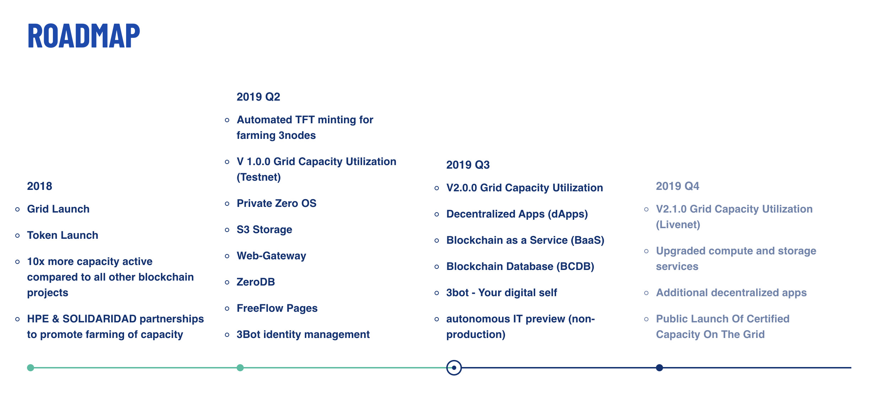
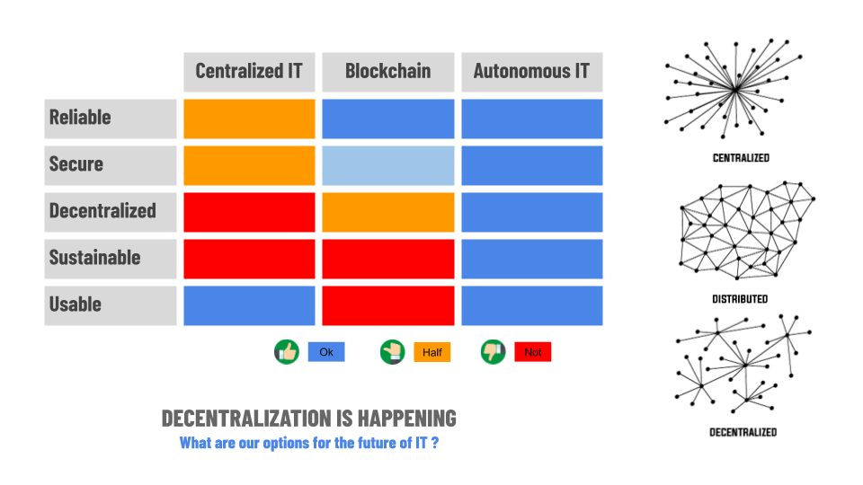
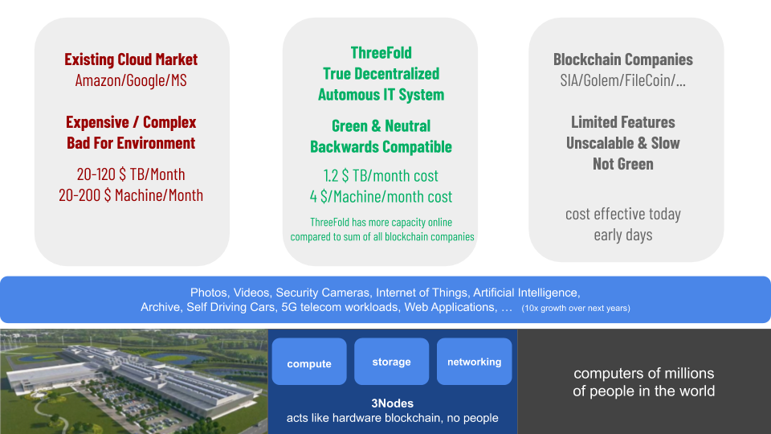

## ThreeFold Update Aug 2019

### We are different

Not everyone can have the same faith in a project, it's normal that a few people's expectations cannot be met and as such might be disappointed.

With the risk of being perceived defensive (which is not the case), I believe it could be a valid exercise to refer back to what we mentioned approx 16 months ago, and reflect on what has happened since then:

**March 2018:**

*   We don’t want to do an ICO, the majority of ICOs are too much hype, it's unsafe to go that path and companies who choose to do so will be in trouble much later on, it will be super hard for them to demonstrate (sustain) the value of their token market cap
    *   Today not that visible yet, most of the ICO company's have a lot of funds which they are still using today, but there is a complete mismatch between value of projects and market cap
    *   Many ICOs got in trouble with regulators already
*   Many crypto currencies as they are today will lose substantial value and while there is huge potential for blockchain technology, many current projects are too much hype and will not do well
    *   Happened and will happen again, we’re not there yet, long term the future is very good
*   Many existing Blockchain technologies are not good enough, we can’t use for our digital currency. 
    *   Is being proved as we go. More to come later.
    *   The downside of this was that we had to create a lot of new technology because there was no real alternative decentralized blockchain technology at that time
    *   We did develop all that technology: atomic swaps, compatibility with ERC, decentralized exchange, rivine proof of blockstake blockchain...
*   Most exchanges are not well set up and lots of fake market making happens, it's a lot of hot air and lots will be hacked, it's not safe enough. Money will be lost.
    *   Happened a lot, search on Google ([ many transactions are fake](https://www.coindesk.com/fake-volume-on-crypto-exchanges-isnt-the-half-of-it), [USD Tether](https://www.forbes.com/sites/francescoppola/2019/03/14/tethers-u-s-dollar-peg-is-no-longer-credible/#49b9c75d451b))
*   Many existing crypto projects are not good enough
    *   Many existing projects are not going anywhere
    *   No real business models
    *   No real technology (or wrongly made)
    *   There is a need for more real stable projects, these will succeed
*   Regulation is a good thing, eventually also digital currencies will be regulated and the way how to fund projects will be more legalized.
    *   Is happening
*   We want to “act” before “talk”
    *   We are almost there, so much has been done (ACT  = deliver)
    *   Starting september we will start “talking”
    *   To all our loyal partners, thank you so much for doing this journey with us in the right way
*   We want a solid token with real backing, something people can rely upon.
    *   Look at our ecosystem (see info below) and how we are building real value
    *   Our principles of our TFT are very sound, check [the token wiki](https://wiki.tokens.grid.tf/#/) for that
*   Values are the most important thing for us, it's not empty claims
    *   We want to live & promote those values, they are part of our DNA.
    *   Just check any video call we have done, any update letter, values are always central.
    *   See our freeflow nation manifesto: [http://freeflowmanifesto.threefold.me](http://freeflowmanifesto.threefold.me)
*   Don't expect quick liquidity for the TFT
    *   Here we have not always been as clear as we should have been, mainly because of the fact that we didn’t know ourselves yet where the markets where going and how to do it.
    *   In March we still considered going on a big exchange, it took us until Summer 2018 before we realized that the approach of using big exchanges and also market making was not the right approach. 
    *   From end of Summer 2018 we have been very clear. We will not do market making (there was an attempt over Summer), we will avoid exchanges we don’t trust yet, we will not rely on fake hype to drive liquidity. This can be found in our updates and video zoom calls.
    *   We always said that from the moment we see a window when we can push liquidity, we would. 
    *   We believe with the more regulated IEOs we can and are planning for Sept 25th 2019.
*   Farmers will not be able to sell their capacity soon (remark was statement 16 months ago, now different)
    *   Here too we did not know the timeline when we started, of course we had hoped to go faster (-: but we chose to do a lot more and be much more solid instead of going out with something which is not nearly as exciting as what we have created now.
    *   We could have gone live with our first generation (in-production) but we decided to wait for release 2 which has the additional autonomous & d-aaps layer.
    *   Early farmers had/have the benefit of farming tokens at a lower cost compared to later farmers. This is why it makes sense for them to wait.
    *   We have now developed the most crazy technology ever and are light years ahead of others, now is the time to go from “act” to “talk,” although this will not happen overnight.
    *   Our release 2.0 code is almost complete and will launch in sept.
*   We are different & decentralized + the foundation is not funded, we need to rely on our ecosystem
    *   There is a growing ecosystem (see our ecosystem doc below) and this proves that we took this very seriously and we are executing on what we said.
    *   A lot of information can be found on our Foundation wiki about how to work in a decentralized context.
    *   We don’t have a centralized entity today which is funded to do marketing.
    *   We have a # farming cooperatives which are taking an active role to promote our ideas and prepare for the IEO (Mazraa, BetterToken, …) Of course some of us are shareholders and investors in multiple of these entities, and also some of us have multiple roles to play.
    *   We have TF Tech which is a software startup with no links to tokens which is of course helping a lot to make this project successful
    *   Do not expect a centralized system to arrange it all.
    *   The TF Foundation eventually will have 60 guardians protecting our interest, not 1 single person will be able to do this. Today it's a group of only 5 people who do this.

### Roadmap 

<<insert-roadmap-image>>

This is the roadmap on our website. The TFT and early version of the TF Grid got launched March 2018. 

Please note that we are delivering much more than what we originally promised in March 2018. 

New compared to March 2018

*   2 new technology layers (see info below, tech whitepaper)
    *   Autonomous Layer
    *   A-DAPS layer  (Decentralized Apps)
*   New Decentralized Apps
    *   FreeFlow Connect (decentralized video conferencing)
    *   FreeFlow Browser (decentralized browser)
    *   FreeFlow Pages (first version now, but this will move to a completely new version Q1 2020)
*   New Technology
    *   BCDB = Blockchain Database (a super scalable better alternative)
    *   3bot (we did not have plans for 3bot as your digital self on the TF Grid)

We try to manage expectations, please read our previous updates as they have a lot of very useful information and show we are executing what we have been promising

*   [http://update_june2019_intro.threefold.me](http://update_june2019_intro.threefold.me)
*   [http://april_update.threefold.me](http://april_update.threefold.me)

#### In a nutshell, what has been delivered in less than 15 months 

Counting since the launch of the TFT/TF Grid in March 2018:

*   The most rock solid decentralized technology in the world  \
(no hype, all functioning components, see info below)
*   All this technology deployed and working (1.x generation now, 2.0 generation end sept)
*   Very solid partnerships to help us to get to global reach when we are ready for it \
(HPE, Solidaridad, SafeCity, Green Edge Cloud, Kleos, NBH Digital…)
*   A lot of capacity deployed (more than all other blockchain projects together)
*   A small but very active community (we did not do public promotion yet)

#### What's new compared to roadmap

In other words what are we working on and delivering which was not part of the original roadmap.

*   GoldToken which will use our TF Grid and underlying technology (3bot)
*   TF Grid Cockpit a new way how to deal with the grid
*   Many more projects in our ecosystem will eventually drive up the utilization of our TF Grid.
*   Kleos and SafeCity project (huge potential for our technical development & reach)
*   Digital identity project (quite some work done over summer in Turkey)
*   **Our planned IEO for an accelerated path to liquidity & higher transaction volumes**

**Any timing risks?**

We said Q4 for v2.1 live net deployment, this is now planned Jan 1 2020. We want to gather a lot of feedback on the deployment we do in Sept of our 2.0 release and make sure we are ready from operational and security perspective.

### We are not a rebellious organization and we like to collaborate 

We are not a rebellious group. We are a growing group of people who don’t want to wait for things to change because, together, we believe we can help the world to heal. We are a passionate group of people who act. We want to work with any government, financial institution, university, or any organization to make this change as long as we agree on the same set of values. You can read more about our values in our [“FreeFlow Nation” manifesto](https://docs.google.com/document/d/1q4R8LCF6oasrrJMe8hsu2yLjtAKYVseuLjpOyyMYEHg/edit). 

Sometimes people think we don’t like the other blockchain projects and we don’t want to collaborate. This is not the case. We want to work with ANY project and help them as much as we can. It would be against our values not to be respectful for what the other projects are trying to accomplish.

We can help a lot of blockchain projects with cost effective and secure infrastructure. We have resolved the blockchain dilemma and anyone can use this to their benefit for their own blockchain or other related workloads. We honestly would like to help anyone and we wish everyone the best and most success. Let us know where we can help and anyone who wants to use our technology is more than welcome. We will organize beyond blockchain and autonomous IT labs (sort of workshops) starting Jan 2020 where everyone can learn how to use the capabilities we have created. 

### Price of the token 

On our dashboard [https://radar.threefold.io](https://radar.threefold.io/) you don’t get a reliable view on the value of the token because there is no real liquidity yet. This confuses many people, which is understandable. The situation will be rather different when we do the IEO.

What is the value of our TFT? This is a difficult question. Once there is a lot of volume and people are using the token to buy capacity on the grid it will be easier and more stable but for now it's an anticipation of future value.

Let's fast forward a couple of months, imagine there are 500.000.000 tokens tradeable at a value of $0.2 (would correspond to a $100m market cap). The market cap for blockchain companies working with infrastructure (storage, compute) together is Billions. But already today TF Grid has more capacity compared to the sum of all infrastructure blockchain companies together and we have better technology.

This shows that there is a lot of room for our TFT to grow. **We have much more capacity, real technology, and we did not overhype. **

We have also created an index to demonstrate the backing of the token (see [here](https://github.com/threefoldfoundation/info_grid/blob/development/docs/concepts/commercial_token_value_calculation.md)). This calculation is based on the deployed capacity versus tokens which can be traded. This calculation is only 1 calculation, it does not say anything about the possible future value of the TFT and this calculation is probably a too-conservative measurement of the token value.

**Some quick facts**

*   We have more capacity compared to the sum of all infrastructure blockchain companies
*   Our technology has been proven and credible partners like HPE & Solidaridad are supporting us.
*   Our technology has unique capabilities (see next chapter)
*   The value of infrastructure blockchain projects:** +2 Billion**
    *    FileCoin (+2Billion) + HoloChain ($126m) + Sia ($93m) + MaidSafe ($77m) + Golem ($47m) + Storj ($21m) + QTUM ($177m) + ...
*   The launch value of a token during our IEO will probably be $0.12
*   Our market cap at launch date will be < $60m, about $15-30m will be up for sale in the planned IEO

**Filecoin Example**

*   30% of tokens were sold for ~$250M. That means they sold at an ~$833M valuation \
Start value of their token was $2.5
*   Value now is ~$7 that means their current market cap value is +$2 Billion
*   Their technology is a small subset of what we have in ThreeFold
    *   storage only
        *   we have more features, we are faster, we are potentially more secure
        *   more cost effective and a lot more sustainable (green)
        *   we need at least 3x less harddisk capacity
        *   we have much more capacity online, biggest site = 60.000.000 GB

Next to these comparables, the tokens get generated in a way that it's undervalued by design. See the [Threefold Whitepaper](https://docs.google.com/document/d/16C3EKKBaK4_DyWFUcvdLnvDyN57h77e0Q1mWMpZL5vc/edit#). Each new farming box (mining of our token) added to the network generates 8x lower amount of tokens compared to potential future commercial value of the capacity added.

I hope above shows why we believe the TFT value has the potential to increase substantially in value not based on hype but based on a real business model for a needed market demand with real proven technology.

### Our technology is unique and real 

ThreeFold has created the only technology available which can deliver on the vision of a true decentralized autonomous internet where everyone can host all their applications and their data at prices which are way lower compared to any technology available today.

**ThreeFold technology delivers Autonomous IT usable for any IT application anywhere in the world.**

### Announcements

#### IEO (Initial Exchange Offering)

**UPDATE IN MEAN TIME, IT'S NOW CALLED A TDE TOKEN DISTRIBUTION EVENT**

We are looking to sell $15-30m in the IEO as organized by Mazraa

IEOs are regulated ways how to sell digital currencies (tokens). We will be clear in our messaging with each IEO platform that this is not an initial coin offering but a sale of our existing IT capacity tokens that exist due to active internet capacity in the field.

We are considering to plan September 25, but some members of community urged us to wait longer.

We will organize a community zoom meeting so we can discuss the options.

See [TF_GoingPublic_Campaign](https://docs.google.com/document/d/1McR4gaRA4JbNBFPFhelmuyYNOr1oPEUhhgBFI0EyQXk/edit#) for more info.

#### Incubaid

Incubaid is our incubator from which the ThreeFold project was born, see [http://www.incubaid.com](http://www.incubaid.com). Further, Incubaid is working on the following projects:

*   Creation & support for our D3 fund in Malta (see our ecosystem doc)
*   Working with Enertia in Dubai (company is fundraising) to see what's next
*   I’ve asked Sophie as the CFO from Incubaid to help me with our governance. She will make sure that every structural/legal/financial action we take is properly structured/documented and in line with our values as mentioned above. Sophie will do this for companies related to Incubaid (see on the website), especially where there are transactions between our companies where we need to make sure everything is properly documented.

#### FreeFlow Organization

FreeFlow has a new website see [https://freeflownation.org](https://freeflownation.org). FreeFlow promotes projects who want to do good for the world. These projects use ThreeFold decentralized technology to make a difference.

#### TF Grid Launch 2.0

Planned to launch end of September 2019. A new set of tools like the TF Cockpit will be available to make the usage of the TF Grid for TF Farmers, TFT holders and buyers plus TF Grid capacity users way more intuitive. This release includes Capacity, Autonomous and dApps Layer. The Capacity layer will run with Zero OS V2.0 and our new networking layer called Zero Mesh. Both software products will boost the stability and scalability of  the TF Grid. More details can be found [here](https://docs.google.com/spreadsheets/d/1StbjySMqYPKE59NLS-TFmkdzTYClAXeuuIfPSke3gw0/edit#gid=0).

#### TF Grid Launch 2.1

Planned to launch January 1st 2020. Ready for production workloads thanks to field tested technology and experienced operational and security teams being in place. Lots of ready made apps and dapps will be available including an App SDK (Software Development Kit) for those who want to develop their own apps for the TF Grid. More details can be found [here](https://docs.google.com/spreadsheets/d/1StbjySMqYPKE59NLS-TFmkdzTYClAXeuuIfPSke3gw0/edit#gid=0).

#### ThreeFold Grid Evolution In Details

First launch of the grid for internal test purposes was **March 2018**, we launched the next version in March 2019 which was usable by everyone, see below for further evolution.

<table>
  <tr>
   <td>
   </td>
   <td>
   </td>
   <td>
   </td>
   <td>
   </td>
   <td>
   </td>
  </tr>
  <tr>
   <td>
   </td>
   <td><strong>March 2019</strong>
   </td>
   <td><strong>Sept 2019</strong>
   </td>
   <td><strong>Jan 2020</strong>
   </td>
   <td><strong>Apr 2020</strong>
   </td>
  </tr>
  <tr>
   <td><strong>Phase</strong>
   </td>
   <td>1.x
   </td>
   <td>2.0
   </td>
   <td>2.1
   </td>
   <td>2.2
   </td>
  </tr>
  <tr>
   <td><strong>Scope</strong>
   </td>
   <td>internal community test environment
   </td>
   <td>Early Adopters
   </td>
   <td>Everyone
   </td>
   <td>Everyone
   </td>
  </tr>
  <tr>
   <td><strong>Token Type</strong>
   </td>
   <td>TFT Testnet
   </td>
   <td>TFT Testnet
   </td>
   <td>TFT Mainnet
   </td>
   <td>TFT Mainnet
   </td>
  </tr>
  <tr>
   <td><strong>Recommended for Production Loads</strong>
   </td>
   <td>no
   </td>
   <td>no
   </td>
   <td>yes
   </td>
   <td>yes
   </td>
  </tr>
  <tr>
   <td><strong>Upgrade Option to Next Net Version</strong>
   </td>
   <td>n/a
   </td>
   <td>automatic
   </td>
   <td>automatic
   </td>
   <td>automatic
   </td>
  </tr>
  <tr>
   <td><strong>Token Transfer Mechanism</strong>
   </td>
   <td>manual
   </td>
   <td>3Bot
   </td>
   <td>3Bot
   </td>
   <td>3Bot
   </td>
  </tr>
  <tr>
   <td>
   </td>
   <td>
   </td>
   <td>
   </td>
   <td>
   </td>
   <td>
   </td>
  </tr>
  <tr>
   <td><strong>Our 3 Layers and Target Audiences  \
(see whitepaper tech)</strong>
   </td>
   <td>
   </td>
   <td>
   </td>
   <td>
   </td>
   <td>
   </td>
  </tr>
  <tr>
   <td>Capacity Layer
   </td>
   <td>Early adopters
   </td>
   <td>Everyone
   </td>
   <td>Everyone
   </td>
   <td>Everyone
   </td>
  </tr>
  <tr>
   <td>Autonomous Layer
   </td>
   <td>-
   </td>
   <td>TF Developers

TF Labs
   </td>
   <td>TF Developers

TF Labs

TF Customers
   </td>
   <td>TF Developers

TF Labs

TF Customers
   </td>
  </tr>
  <tr>
   <td>dApp Layer
   </td>
   <td>-
   </td>
   <td>TF Developers
   </td>
   <td>TF Developers
   </td>
   <td>TF Developers
   </td>
  </tr>
  <tr>
   <td>
   </td>
   <td>
   </td>
   <td>
   </td>
   <td>
   </td>
   <td>
   </td>
  </tr>
  <tr>
   <td><strong>Primitives for Capacity Layer</strong>
   </td>
   <td>
   </td>
   <td>
   </td>
   <td>
   </td>
   <td>
   </td>
  </tr>
  <tr>
   <td>ZDB = storage container
   </td>
   <td>yes
   </td>
   <td>yes
   </td>
   <td>yes
   </td>
   <td>yes
   </td>
  </tr>
  <tr>
   <td>Container from Docker
   </td>
   <td>yes
   </td>
   <td>yes
   </td>
   <td>yes
   </td>
   <td>yes
   </td>
  </tr>
  <tr>
   <td>Container Ubuntu
   </td>
   <td>yes
   </td>
   <td>yes
   </td>
   <td>yes
   </td>
   <td>yes
   </td>
  </tr>
  <tr>
   <td>Web Gateway
   </td>
   <td>Limited
   </td>
   <td>few locations
   </td>
   <td>yes
   </td>
   <td>yes
   </td>
  </tr>
  <tr>
   <td>Overlay Network
   </td>
   <td>yes/Zero Tier
   </td>
   <td>yes/Zero Mesh
   </td>
   <td>yes/Zero Mesh
   </td>
   <td>yes/Zero Mesh
   </td>
  </tr>
  <tr>
   <td>
   </td>
   <td>
   </td>
   <td>
   </td>
   <td>
   </td>
   <td>
   </td>
  </tr>
  <tr>
   <td><strong>Tools</strong>
   </td>
   <td>
   </td>
   <td>
   </td>
   <td>
   </td>
   <td>
   </td>
  </tr>
  <tr>
   <td>ThreeFold Directory
   </td>
   <td>yes
   </td>
   <td colspan="3" >-------------------------- replaced by 3bot SDK 
   </td>
  </tr>
  <tr>
   <td>ThreeFold HUB
   </td>
   <td>yes
   </td>
   <td>yes
   </td>
   <td>yes
   </td>
   <td>yes
   </td>
  </tr>
  <tr>
   <td>Jumpscale SDK
   </td>
   <td>yes
   </td>
   <td colspan="3" >-------------------------- replaced by 3bot SDK 
   </td>
  </tr>
  <tr>
   <td>ThreeFold Cockpit (admin tool, replaces TFdirectory, explorer, radar)
   </td>
   <td>no
   </td>
   <td>yes
   </td>
   <td>yes
   </td>
   <td>yes
   </td>
  </tr>
  <tr>
   <td>Itsyou.Online Authentication
   </td>
   <td>yes
   </td>
   <td colspan="3" >-------------------- replaced by 3bot authentication 
   </td>
  </tr>
  <tr>
   <td>Farmer 3Bot plugin
   </td>
   <td>no
   </td>
   <td>maybe
   </td>
   <td>yes
   </td>
   <td>yes
   </td>
  </tr>
  <tr>
   <td>3Bot Authentification
   </td>
   <td>no
   </td>
   <td>yes
   </td>
   <td>yes
   </td>
   <td>yes
   </td>
  </tr>
  <tr>
   <td>3Bot SDK (osx, linux, docker)
   </td>
   <td>no
   </td>
   <td>yes
   </td>
   <td>yes
   </td>
   <td>yes
   </td>
  </tr>
  <tr>
   <td>3Bot App
   </td>
   <td>no
   </td>
   <td>yes
   </td>
   <td>yes
   </td>
   <td>yes
   </td>
  </tr>
  <tr>
   <td><strong>Apps</strong>
   </td>
   <td>
   </td>
   <td>
   </td>
   <td>
   </td>
   <td>
   </td>
  </tr>
  <tr>
   <td>Ready Made Apps
   </td>
   <td>yes (flists)
   </td>
   <td>yes (flists)
   </td>
   <td>yes
   </td>
   <td>yes
   </td>
  </tr>
  <tr>
   <td>Autonomous D-APPS
   </td>
   <td>no
   </td>
   <td>no
   </td>
   <td>yes
   </td>
   <td>yes
   </td>
  </tr>
  <tr>
   <td>App SDK (make your own apps)
   </td>
   <td>no
   </td>
   <td>yes (early adopter)
   </td>
   <td>yes
   </td>
   <td>yes
   </td>
  </tr>
  <tr>
   <td>Ready Made Decentralized Apps
   </td>
   <td>no
   </td>
   <td>yes (first 3bot app)
   </td>
   <td>yes
   </td>
   <td>yes
   </td>
  </tr>
  <tr>
   <td>
   </td>
   <td>
   </td>
   <td>
   </td>
   <td>
   </td>
   <td>
   </td>
  </tr>
  <tr>
   <td><strong>Software</strong>
   </td>
   <td>
   </td>
   <td>
   </td>
   <td>
   </td>
   <td>
   </td>
  </tr>
  <tr>
   <td>Zero OS
   </td>
   <td>v1.x
   </td>
   <td>v2.0
   </td>
   <td>tbd
   </td>
   <td>tbd
   </td>
  </tr>
  <tr>
   <td>Rivine
   </td>
   <td>1.1.2
   </td>
   <td>1.1.3
   </td>
   <td>1.1.3
   </td>
   <td>1.1.4
   </td>
  </tr>
  <tr>
   <td>JumscaleX (JSX)
   </td>
   <td>10.0.0
   </td>
   <td>10.1.0
   </td>
   <td>tbd
   </td>
   <td>tbd
   </td>
  </tr>
  <tr>
   <td>
   </td>
   <td>
   </td>
   <td>
   </td>
   <td>
   </td>
   <td>
   </td>
  </tr>
  <tr>
   <td><strong>TFGrid Capacity Types</strong>
   </td>
   <td>
   </td>
   <td>
   </td>
   <td>
   </td>
   <td>
   </td>
  </tr>
  <tr>
   <td>Do It Yourself Capacity (all farmers)
   </td>
   <td>yes
   </td>
   <td>yes
   </td>
   <td>yes
   </td>
   <td>yes
   </td>
  </tr>
  <tr>
   <td>Certified Capacity
   </td>
   <td>no
   </td>
   <td>no
   </td>
   <td>yes
   </td>
   <td>yes
   </td>
  </tr>
  <tr>
   <td>Managed Capacity (virtual envs)
   </td>
   <td>no
   </td>
   <td>no
   </td>
   <td>yes
   </td>
   <td>yes
   </td>
  </tr>
  <tr>
   <td>
   </td>
   <td>
   </td>
   <td>
   </td>
   <td>
   </td>
   <td>
   </td>
  </tr>
  <tr>
   <td>
   </td>
   <td>
   </td>
   <td>
   </td>
   <td>
   </td>
   <td>
   </td>
  </tr>
  <tr>
   <td><strong>Roadmap: Teams/Services</strong>
   </td>
   <td>
   </td>
   <td>
   </td>
   <td>
   </td>
   <td>
   </td>
  </tr>
  <tr>
   <td>Software available for viable product for TF Grid
   </td>
   <td>yes
   </td>
   <td>yes
   </td>
   <td>yes
   </td>
   <td>yes
   </td>
  </tr>
  <tr>
   <td>Operational team in place to support SW & TF Grid services
   </td>
   <td>small
   </td>
   <td>still very limited
   </td>
   <td>ok
   </td>
   <td>experienced
   </td>
  </tr>
  <tr>
   <td>Security & Anti Hacking Team
   </td>
   <td>no
   </td>
   <td>no
   </td>
   <td>activated
   </td>
   <td>yes
   </td>
  </tr>
  <tr>
   <td>Digital currency & blockchain delivery/consultancy team in place
   </td>
   <td>no
   </td>
   <td>no
   </td>
   <td>yes
   </td>
   <td>yes
   </td>
  </tr>
  <tr>
   <td>Beyond Blockchain Labs Concept operational
   </td>
   <td>no
   </td>
   <td>no
   </td>
   <td>yes
   </td>
   <td>yes
   </td>
  </tr>
  <tr>
   <td>Autonomous IT Labs Concept operational
   </td>
   <td>no
   </td>
   <td>no
   </td>
   <td>yes
   </td>
   <td>yes
   </td>
  </tr>
</table>

### What if after reading all of this you’re still not comfortable? 

It's impossible to do good for everyone. I am sure there are people who like different types of projects, maybe more standard crypto or speculative or …

If you feel this project is not for you and you would like to sell your TFTs please contact Adnan or Nickolay from Mazraa (TF Farming Cooperative in Dubai) who are organizing the IEO. There will be possibilities for people to sell. Mazraa is willing to resell your TFTs in the IEO at conditions to be defined by Mazraa.

### There is a lot of information already available

*   FreeFlow Nation (values and using the TF Tech to do good for the world)
    *   Website: [https://www.freeflownation.org](https://www.freeflownation.org)
    *   Manifesto: [http://freeflowmanifesto.threefold.me](http://freeflowmanifesto.threefold.me)
*   ThreeFold Grid
    *   Website: [www.threefold.io](http://www.threefold.io)  (being redone)
    *   Lots of wiki pages (start from website)	
    *   [ThreeFold Grid Whitepaper ](https://docs.google.com/document/d/16C3EKKBaK4_DyWFUcvdLnvDyN57h77e0Q1mWMpZL5vc/edit)
*   ThreeFold Movement
    *   [ThreeFold Ecosystem](https://docs.google.com/document/d/1TiuVr9xhoAiAqZD0GTMvxphS8oY2CkjM3V2iWIS-p1M/edit#heading=h.ucby0l7pb1jb)
    *   Whitepaper: [The world needs a true decentralized internet/data system](https://docs.google.com/document/d/1uZT03h4QLBh2RYEnUjZQvi2Xoy8fjbUn1eZN_PM8g6g/edit#)
*   ThreeFold Tech
    *   Website: [www.threefold.tech](http://www.threefold.tech)
    *   [ThreeFold Technology Whitepaper](https://docs.google.com/document/d/1WTHrbe3nS1_VgTYxgDPeyyEmvj7unIcEPwrg0l3SBNI/edit) (read this one first)
        *   [Capacity Layer Whitepaper](https://docs.google.com/document/d/1dP5MaY9YWdRonhvGtqBKrcTYbBYBold75vHnHpTiUH4/edit#)
        *   [Autonomous Layer Whitepaper](https://docs.google.com/document/d/1qEaAqYxL0v9ZnwcMtud61SJUvDcz6DS_wRqPykPh1Y8/edit#heading=h.b30ugijlkj83)

This document can be found on

[http://aug_update_2019.threefold.me](http://aug_update_2019.threefold.me)

