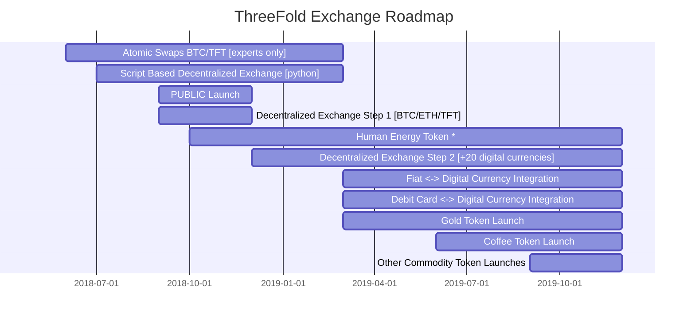

## Planning ThreeFold Exchange

[comment]: # (

```mermaid
gantt
    title ThreeFold Exchange Roadmap
    dateFormat  YY-MM
    Atomic Swaps BTC/TFT [experts only]        :18-06, 19-03
    Script Based Decentralized Exchange [python]        :18-07, 19-03
    PUBLIC Launch       :18-09, 18-12    
    Decentralized Exchange Step 1 [BTC/ETH/TFT]         :18-09, 18-12
    Human Energy Token * :18-10, 19-12
    Decentralized Exchange Step 2 [+20 digital currencies]          :18-12, 19-12
    Fiat <-> Digital Currency Integration :19-03, 19-12
    Debit Card <-> Digital Currency Integration :19-03, 19-12
    Gold Token Launch         :19-03, 19-12
    Coffee Token Launch          :19-06, 19-12
    Other Commodity Token Launches          :19-09, 19-12
```
)

See [here](https://raw.githubusercontent.com/threefoldfoundation/info_foundation/development/docs/strategy/images/exchange.png) for more detail.