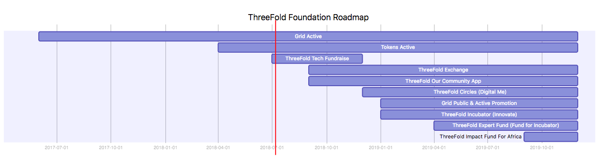
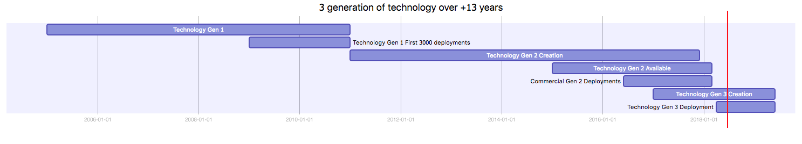
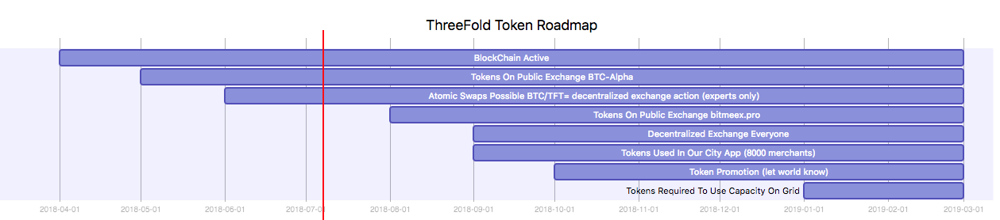
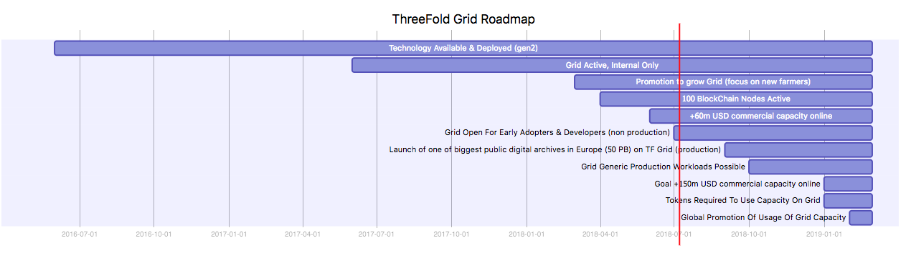
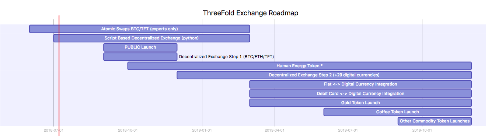

# ThreeFold Roadmaps & Planning


## Planning ThreeFold Foundation (high level)

<!-- [](roadmap.html ':include text') -->


<!--- [roadmap](roadmap.html ':include width=1000px height=400px')

// [test](test.html ':include width=1000px height=600px')

// [jsjoint](jsjoint.html ':include width=1000px height=100px')
--->

<!--- ```mermaid
gantt
    title ThreeFold Foundation Roadmap (live)
    dateFormat  YY-MM
    Grid Active                :17-06, 19-12
    Tokens Active              :18-04, 19-12
    ThreeFold Tech Fundraise   :18-07, 18-12
    ThreeFold Exchange         :18-09, 19-12    
    ThreeFold Our Community App            :18-09, 19-12
    ThreeFold Circles (Digital Me)         :18-12, 19-12    
    Grid Public & Active Promotion     :19-01, 19-12
    ThreeFold Incubator (Innovate) :19-01, 19-12
    ThreeFold Expert Fund (Fund for Incubator) :19-04, 19-12
    ThreeFold Impact Fund For Africa: 19-09, 19-12

``` --->



See [here](https://raw.githubusercontent.com/threefoldfoundation/info_foundation/masterstrategy/images/highlevel.png) for more detail.


## History Technology Creation

<!-- ```mermaid
gantt
    title 3 generation of technology over +13 years
    dateFormat  YYYY-MM-DD
    Technology Gen 1        :a1, 2005-01-01, 2011-01-01
    Technology Gen 1 First 3000 deployments           :a2, 2009-01-01, 2011-01-01
    Technology Gen 2 Creation           :a3, 2011-01-01, 2017-12-01    
    Technology Gen 2 Available           :a4, 2015-01-01, 2018-03-01
    Commercial Gen 2 Deployments           :a5, 2016-06-01, 2018-03-01
    Technology Gen 3 Creation           :a6, 2017-01-01, 2019-06-01        
    Technology Gen 3 Deployment           :a7, 2018-04-01, 2019-06-01            

``` -->



See [here](https://raw.githubusercontent.com/threefoldfoundation/info_foundation/masterstrategy/images/past.png) for more detail.

## Planning ThreeFold Tokens

<!-- ```mermaid
gantt
    title ThreeFold Token Roadmap
    dateFormat  YY-MM

    BlockChain Active          :18-04, 19-03
    Tokens On Public Exchange BTC-Alpha         :18-05, 19-03
    Atomic Swaps Possible BTC/TFT= decentralized exchange action (experts only)        :18-06, 19-03
    Tokens On Public Exchange bitmeex.pro          :18-08, 19-03    
    Decentralized Exchange Everyone          :18-09, 19-03
    Tokens Used In Our City App (8000 merchants) :18-09, 19-03
    Token Promotion (let world know)  : 18-10,19-03
    Tokens Required To Use Capacity On Grid       :19-01, 19-03
``` -->



See [here](https://raw.githubusercontent.com/threefoldfoundation/info_foundation/masterstrategy/images/tokens.png) for more detail.

## Planning ThreeFold Grid

<!-- ```mermaid
gantt
    title ThreeFold Grid Roadmap
    dateFormat  YY-MM

    Technology Available & Deployed (gen2)  :16-06, 19-03
    Grid Active, Internal Only              :17-06, 19-03
    Promotion to grow Grid (focus on new farmers)       :18-03, 19-03
    100 BlockChain Nodes Active          :18-04, 19-03
    +60m USD commercial capacity online      :18-06, 19-03    
    Grid Open For Early Adopters & Developers (non production)      :18-07, 19-03
    Launch of one of biggest public digital archives in Europe (50 PB) on TF Grid (production)         :18-09, 19-03
    Grid Generic Production Workloads Possible      :18-10, 19-03
    Goal +150m USD commercial capacity online      :19-01, 19-03        
    Tokens Required To Use Capacity On Grid       :19-01, 19-03
    Global Promotion Of Usage Of Grid Capacity  :19-02, 19-03

``` -->


See [here](https://raw.githubusercontent.com/threefoldfoundation/info_foundation/masterstrategy/images/grid.png) for more detail.

## Planning ThreeFold Exchange

<!-- ```mermaid
gantt
    title ThreeFold Exchange Roadmap
    dateFormat  YY-MM

    Atomic Swaps BTC/TFT (experts only)        :18-06, 19-03
    Script Based Decentralized Exchange (python)        :18-07, 19-03
    PUBLIC Launch       :18-09, 18-12    
    Decentralized Exchange Step 1 (BTC/ETH/TFT)          :18-09, 18-12
    Human Energy Token * :18-10, 19-12
    Decentralized Exchange Step 2 (+20 digital currencies)          :18-12, 19-12

    Fiat <-> Digital Currency Integration :19-03, 19-12
    Debit Card <-> Digital Currency Integration :19-03, 19-12
    Gold Token Launch         :19-03, 19-12
    Coffee Token Launch          :19-06, 19-12
    Other Commodity Token Launches          :19-09, 19-12

``` -->


See [here](https://raw.githubusercontent.com/threefoldfoundation/info_foundation/masterstrategy/images/exchange.png) for more detail.
