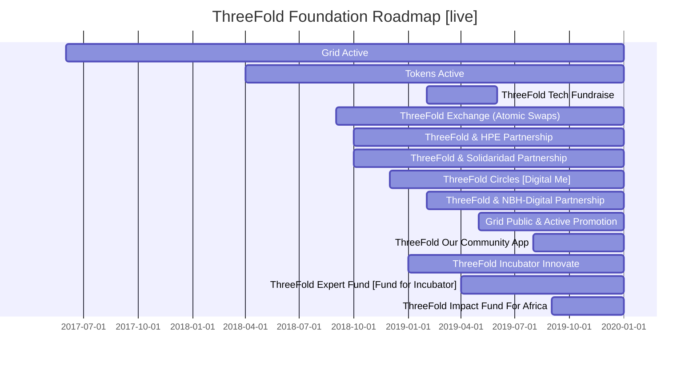
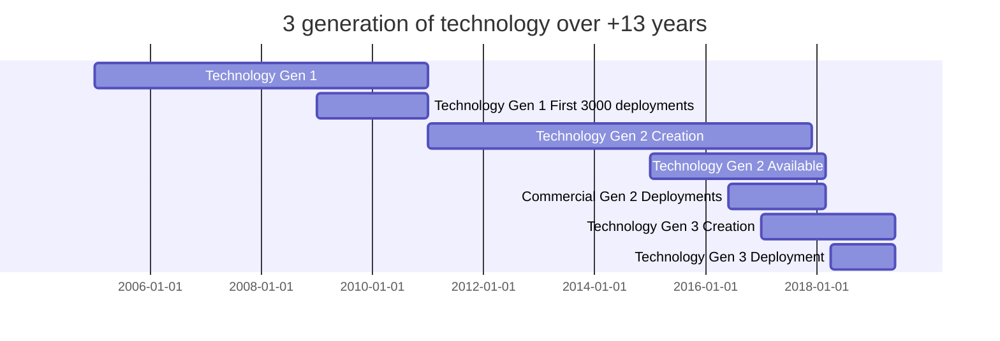
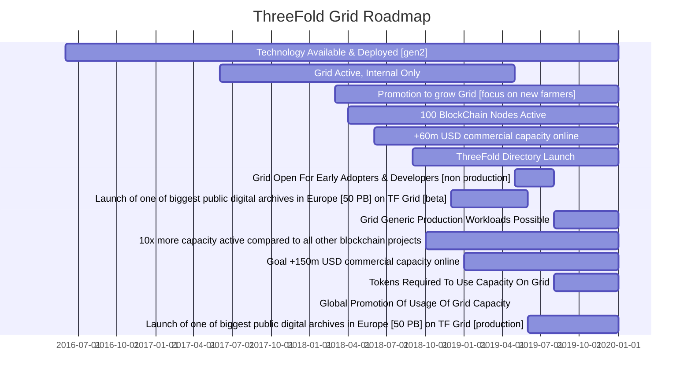

# ThreeFold Roadmaps & Planning


## Planning ThreeFold Foundation (high level)
[comment]: # (

)


See [here](https://raw.githubusercontent.com/threefoldfoundation/info_foundation/development/docs/strategy/images/highlevel.png) for more detail.


## History Technology Creation
[comment]: # (

)


See [here](https://raw.githubusercontent.com/threefoldfoundation/info_foundation/development/docs/strategy/images/past.png) for more detail.

## Planning ThreeFold Tokens

[comment]: # ( 
```mermaid
gantt
    title ThreeFold Token Roadmap
    dateFormat  YY-MM
    BlockChain Active          :18-03, 20-01
    Mobile Wallet Release : 18-04, 20-01
    Tokens On Public Exchange BTC-Alpha         :18-05, 20-01
    Atomic Swaps Possible BTC/TFT= decentralized exchange action [experts only]        :18-06, 20-01
    Tokens On Public Exchange bitmeex.pro          :18-08, 20-01
    Token ERC-20 Bridge : 19-5,20-1    
    Token Promotion [let world know]  : 19-6,20-1
    Tokens Required To Use Capacity On Grid:19-05, 20-01
```
)


See [here](https://raw.githubusercontent.com/threefoldfoundation/info_foundation/development/docs/strategy/images/tokens.png) for more detail.

## Planning ThreeFold Grid

[comment]: # (

)


See [here](https://raw.githubusercontent.com/threefoldfoundation/info_foundation/development/docs/strategy/images/grid.png) for more detail.

